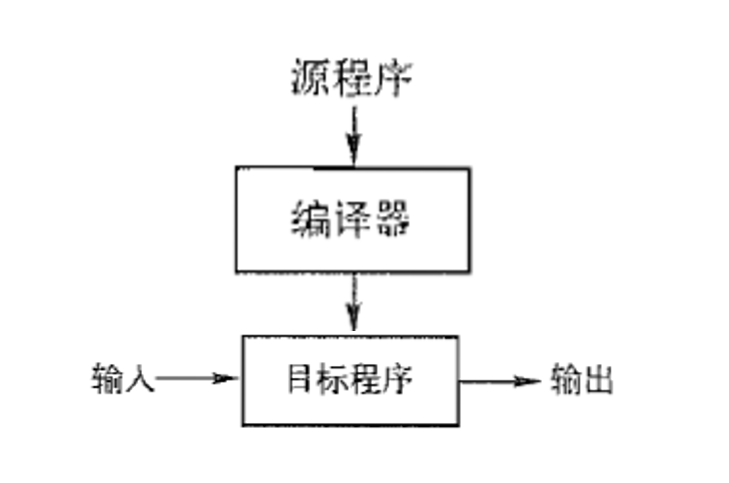
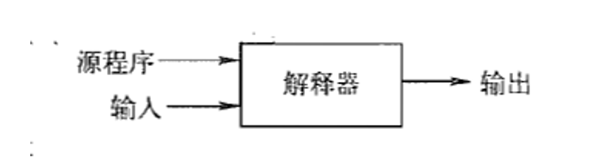
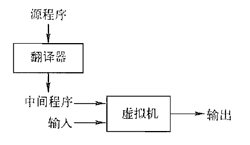
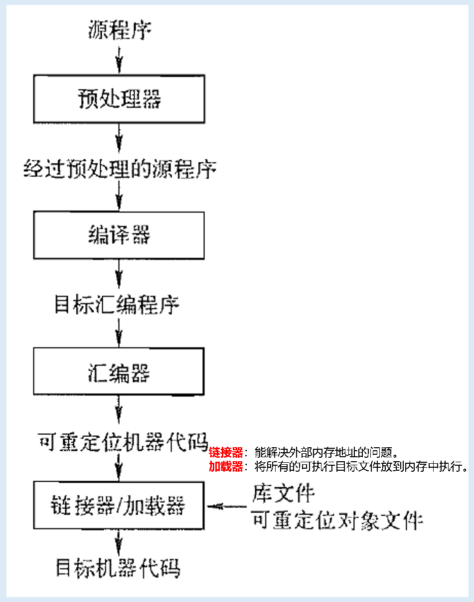
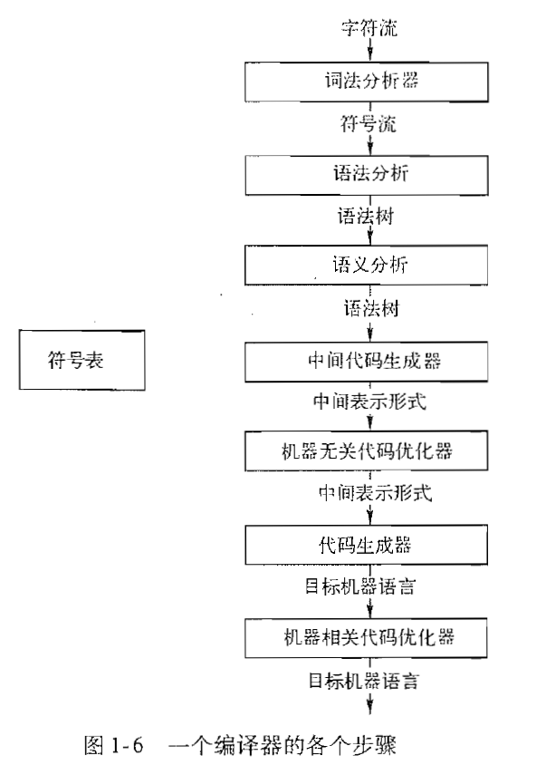
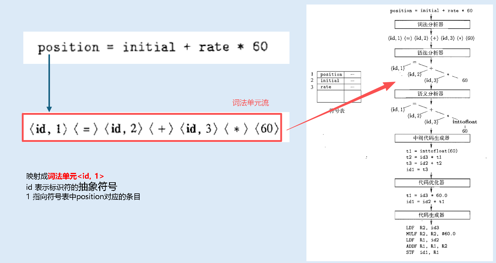
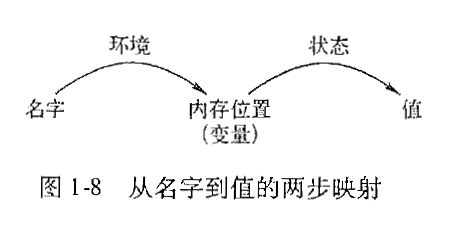

<h1 align="center">📒 Chapter01 概述 学习笔记</h1>

## 1. 语言处理器
**`程序设计语言`** ：向人及计算机描述计算过程的记号。

在计算机上运行的所有软件都是使用某种程序设计语言编写。在程序运行之前，需要被翻译成一种可以被计算机执行的形式，做这个翻译工作的软件系统称为 **`编译器（compiler）`** 。

研究编译器的编写会涉及到 **`程序设计语言、计算机体系结构、形式语言理论、算法和软件工程`** 。

**`编译器`** ：把一种语言（源语言）编写的程序翻译成另一种语言（目标程序语言）的程序的一种。

- 编译器的任务：在翻译过程中报告其错误。
- 目标程序：可以被用户调用可执行的机器语言程序。
    - 将输入处理后生成输出

**`解释器（Interpreter）`** ：语言处理器。将用户提供的输入执行源程序中指定操作后输出结果。

解释器和编译器的混合类型：

- 经典案例：Java语言处理器结合了编译和解释过程。 在一台机器编译的字节码可以在另一台机器上解释执行。

- 快速完成输入到输出的处理过程的方式称为即时（Just in time）编译器。

对于完整的一个程序来说，会分成多个部分进行编译和处理：

对于程序来说，将多个源程序通过编译器处理后，生成汇编语言程序，然后汇编器将其处理，然后链接器和加载器处理后生成目标机器代码。

## 2. 一个编译器的结构
编译器可以看做是一个将源程序映射为在语义上等价的目标程序的黑盒子，而这个映射过程由两个部分：

- 分析部分：前端（front end）
    - 作用：检查源程序的语法和语义准确性，提供有效信息辅助用户修正错误。
    - 源程序分解成多个要素加上语法结构，然后使用语法结构来创建源程序的一个中间表示。
    - 会收集源程序的信息将其存放在符号表的数据结构中。

- 综合部分：后端（back end）
    - 将中间表示和符号表中的信息来构造目标程序。

编译器把编译程序分解成多个步骤，然后将多个步骤组合在一起从而生成机器目标程序。主要分为几个阶段：

|阶段|输入|输出|功能|
|--|--|--|--|
|词法分析|字符流|记号流 (Tokens)|识别单词，去除空白和注释。|
|语法分析|记号流|语法树/抽象语法树 (AST)|检查程序的语法结构。|
|语义分析|语法树|注释后的语法树|检查类型兼容性、变量声明等语义规则。|
|中间代码生成|语法树|中间代码 (IR)|生成一个机器无关的、类似汇编的代码。|
|代码优化|中间代码|优化的中间代码|改进中间代码，使其运行更快、占用空间更小。|
|目标代码生成|中间代码|目标机器代码|生成目标机器能执行的指令序列。|

对于编译器的每个步骤来说，每个步骤中读入一个输入文件并产生一个输出文件。

### 2.1 词法分析（lexical analysis）
词法分析（编译器的第一个步骤）：读入组成源程序的字符流，将字符流组织成有依稀词素（lexeme）的序列。

词法分析器会生成词法单元，生成格式：$ <token-name, attribute-value> $，其中 `token-name` 语法分析步骤中使用的抽象符号，`attribute-value` 是指向符号表中关于词法单元的条目。

> 对于分隔词素的空格会被词法分析器忽略掉。

### 2.2 语法分析（syntax analysis）
语法分析（或解析）：使用由词法分析器生成的各个词法单元的第一个分量来创建树形的中间表示。常用的表示方法是语法树（syntax tree）：

- 树中的每个内部结点表示一个运算。
- 该结点的子结点表示该运算的一个分量。
 
编译器的后续步骤，都会使用语法结构去分析源程序，并生成目标程序。

### 2.3 语义分析
**`语义分析器（semantic analyzer）`** 的作用：

- 使用语法树和符号表中的信息来检查源程序是否和语言定义的语义一致。
- 也会收集类型信息，把信息存放在语法树和符号表中，便于在中间代码生成过程中使用。

根据语义分析器的作用，所以`语义分析`的重要部分是：**`类型检查（type checking）`**。编译器会检查每个运算符是否具有匹配的运算分量。

> 典型案例：如程序语言中，会检查数组下标是否为整数。

程序设计语言可能允许某些类型转换，称为 **`自动类型转换（coercion）`** 。案例：二元运算符的计算(整数和浮点数之间的计算，会进行类型转换)

### 2.4 中间代码生成
把一个源程序翻译成目标代码的过程中，一个编译器可能构造出`一个或多个中间表示`。中间表达式的形式有多种，语法树通常在语法分析和语义分析中使用的一种中间表示形式。

在语法分析和语义分析完成后，编译器会生成一个低级语言或者类机器语言的中间表示。而中间表示有两个重要性质：

- 易于生成
- 能够被轻松翻译成目标机器上的语言。

### 2.5 代码优化
- 机器无关的代码优化步骤试图改进中间代码，以便生成更好的目标代码。

- 使用一个简单的中间代码生成算法，再进行代码优化步骤是生成优质目标代码的一个合理方法。对于不同的编译器所做代码优化工作差异很大。

### 2.6 代码生成
代码生成器以源程序的中间表示形式作为输入，并把它映射到目标语言。如果目标语言是机器代码（汇编语言），就必须为程序使用的每个变量选择寄存器或者内存位置。然后中间指令被翻译成能够完成相同任务的机器指令序列。

**代码生成的核心点：合理分配寄存器以存放变量的值。**

### 2.7 符号表管理
符号表：记录源程序中使用的变量的名字，并收集和每个名字的各种属性有关的信息。这一特性由编译器的功能提供。

符号表数据结构会为每个变量名字创建一个记录条目。

- 记录的字段就是名字的各个属性。
- 数据结构应该允许编译器迅速找到每个名字的记录，并向记录中快速存放和获取记录中的数据。

### 2.8 编译器的构造工具
常见的编译器构造工具如下：

- 语法分析器的生成器
- 扫描器的生成器
- 语法制导的翻译引擎
- 代码生成器的生成器
- 数据流分析引擎
- 编译器构造工具集

## 3. 程序设计语言的发展历程
第一台电子计算机出现在20世纪40年代。它使用0、1序列组成的机器语言编程。

### 3.1 走向高级程序设计语言
- 贴合人类的程序设计语言是20世纪50年代，早期使用**助记汇编语言**进行开发。
- 之后出现几个语言
    - Fortran语言：用于科学计算
    - Cobol语言：用于商业数据处理
    - Lisp语言：用于符号计算

在后续语言新特性发展，把语言通过代的方式来分类如下：

- 第一代语言：**机器语言**
- 第二代语言：**汇编语言**
- 第三代语言：**高级语言（Fortra、Cobol、Lisp、C/C++、C#、Java等）**
- 第四代语言：**特定应用设计的语言（SQL、Prolog等）**

另外一种分类方式分为两种：

- **强制式（imperative）**：指明如何完成一个计算任务。如：C/C++、C#、Java等。
- **声明式（declarative）**：指令要进行哪些计算。如：Haskell函数式语言

**冯诺依曼语言** ：指以冯诺依曼计算机体系结构为计算模型的程序设计语言。

**面向对象语言**：支持面向对象编程（用一组相互作用的对象组成程序的编程风格）的语言。典型语言：C++、Java等。

**脚本语言**：具有高层次运算符的解释型语言，常用于把多个计算过程合在一起，这个计算过程称为脚本。典型语言：Shell、awk、perl和python等。

### 3.2 对编译器的影响
程序设计语言的的设计和编译器是密切相关。在多种因素的影响下，编译器就会有新的发展方向：

- 需要设计相应算法和表示方法来翻译和支持新程序语言的语言特征。
- 计算机体系结构的发展，需要新的翻译算法来发挥新硬件的能力。
- 降低用高级语言程序的执行开销。
- 语言处理系统的发展，需要翻译和兼容更多目标机。

编译器必须能正确翻译用源语言写的程序代码。但一个源程序生成最佳目标代码的问题是不可预知性。所以编译器的设计必须作出折中处理，确定解决哪些问题，使用哪些启发式信息，以便于解决高效代码生成的问题。

## 4. 编译技术的应用

### 4.1 高级程序设计语言的实现
一个高级程序设计语言定义了一个编程抽象：开发者使用这个语言表达算法，而编译器必须把程序翻译成目标语言。

高级语言和低级语言的对比：

- 高级语言
    - Fortran、C/C++、Java等。
    - 特点
        - 不依赖机器，移植形高。
        - 编程容易，不易出错，但目标程序运行低效。
        - 可维护性强

- 低级语言
    - 字位码、汇编语言、机器语言
    - 特点
        - 计算过程可控，可产生高效代码，但编写难度大。
        - 可移植性较差，容易出错。
        - 难以维护。

优化编译器的目的就是提高生成代码性能的技术，弥补因高层次抽象语言引入的低效率的问题。

### 4.2 针对计算机体系结构的优化
计算机体系结构对编译器技术的影响，所以几乎所有的高性能系统都利用了两种技术：

- 并行性（parallelism）：出现在多个层次上。
    - 指令层次：多个运算可以被同时运行、
        - 现代微处理器都采用指令级并行性。
    - 处理器层次：同一个应用的多个不同线程在不同的处理器上运行。
        - 多处理器的发展，多线程的代码也会体现在处理器级别的分配、同步和通信等。
    
- 内存层次结构（Memory Hierarchy）
    - 可以创建非常快的内存，或非常大的内存，但无法创建非常大又非常快的内存。
    - 内存层次由几层不同速度和大小的存储器组成。
        - 离处理器最近的层速度最快，但容量最小。

    - 优化方式：
        - 改变数据的布局或者数据访问代码的顺序来提高内存层次的效率。
        - 改变代码的布局来提高指令高速缓存的效率。

### 4.3 新计算机体系结构的设计
在计算机体系结构设计的早期，编译器是在机器建造好之后再开发。现代计算机体系结构的开发中，编译器在处理器设计阶段时就开发，然后编译得到代码后并运行于模拟器上。

- 常见的两种体系结构：**RISC** 和 **CISC**

    - CISC：Complex Instruction-Set Computer，复杂指令计算机。PowerPC、SPARC、MIPS、Alpha和PA-RISC都是基于RISC概念设计。
    - RISC：Reduced Instruction-Set Computer，精简指令集计算机。只x86架构使用。

- 专用体系结构：特定用途的体系结构概念。
    - 数据流机器
    - 向量机
    - VLIW（非常长指令字）
    - SIMD（单指令多数据）处理器阵列
    - 心动阵列（systolic array）
    - 共享内存的多处理器
    - 分布式内存的多处理器

编译器技术和嵌入式设备的发展，就会针对特定的需求、经济效能等角度考虑，从而需要编译器技术来支持和设计不一样的体系结构，从而支持特定架构进行编程。

### 4.4 程序翻译
把编译看作是从一个高级语言到机器语言的翻译过程。翻译技术的一些应用：

- 二进制翻译：把一个机器的二进制代码翻译成另一个机器的二进制代码，使得编译的程序能兼容或者运行在不同的机器中。
- 硬件合成：硬件设计时也会使用高级硬件描述语言，如VHDL和Verilog等。
    - 需要开发特定的翻译工具来翻译硬件语言。
- 数据查询解释器
    - 数据库语言，如SQL
- 编译然后模拟：模拟器也是典型的翻译测试工具。
    - 模拟是用来理解一个现象或者验证一个设计。
    - 模拟器的输入通常包含了设计描述和某次特定模拟运行的具体输入参数。

### 4.5 软件生产率工具
测试是对系统中的错误进行定位的主要技术。目前最成功的辅助性方法就是通过数据流分析技术静态地（即在程序运行之前）定位错误。

常见的程序分析技术的几个方法：

- 类型检查：类型不一致
- 边界检查：C语言的数组越界问题。
- 内存检查工具：垃圾回收机制（解决内存管理错误的问题）

## 5. 程序设计语言基础

### 5.1 动态和静态的区别
- **静态（编译时决定）**：编译器编译阶段就作出的决定策略。
    - 静态作用域：注意static不是声明变量的作用域，而是编译器确定了用于存放被声明变量的内存位置的能力。

- **动态（运行时决定）**：只允许在运行程序时作出的决定策略。
    - 动态作用域：程序运行时，同一个对变量的使用会指向变量的几个声明中某一个。

### 5.2 环境与状态
对于程序设计语言来说，需要注意一点：在程序运行时发生的改变是否会影响数据元素的值，还是影响了对那个数据的名字的解释。

名字和内存（存储）位置的关联，及之后和值的关联可以用两个映射。

- 环境：从`名字`到`变量（存储位置）`的映射。

- 状态：从`内存位置`到其`对应的值`的映射。

环境的改变需要遵守语言的作用域规则。环境和状态映射是动态的，也有另外：

- 名字到位置的静态绑定与动态绑定。
    - 大部分是动态的。

- 从位置到值的静态绑定与静态绑定。
    - 一般是动态的。例外：C语言中 `#define` 声明的常量。

### 5.3 静态作用域和块结构
C语言的作用域规则是基于程序结构，一个声明的作用域由该声明在程序中出现的位置隐含地决定。

块（block）是声明和语句的一个组合。在C语言中使用`括号{}` 来界定一个块。其它语言中也有begin和end作为块的界定。

> - 名字和变量通常是同一个事物。使用是需要区别编译时的名字和名字在运行时所指的内存位置。
>
> - 标识符
>   - 由字母和数字组成的字符串。
>   - 用来指向（标记）一个实体。
>   - 注意：所有的标识符都是名字，但不是所有的名字都是标识符。
>
> - 变量指向存储中的某个特定的位置。
>   - 如果多次声明一个标识符，就会引入一个新的变量。
>   - 每个标识符只声明一次，一个递归过程的局部标识符会在不同时刻指向不同的存储位置。

C语言中的静态作用域的规则：

- 一个C程序由一个顶层的变量和函数声明的序列组成。
- 函数内可声明变量（包括局部变量和参数）。
- 一个函数通常返回某个类型（即：返回类型）的值，而一个过程不返回任何值。

C语言中的块语法：

- 块是一种语句。
- 声明和语句用括号包围：一个块包含了声明的序列，然后再跟着一个语句序列。
- 注意：一个块允许嵌套在另一块内。但不能在函数内部定义另一个函数。

### 5.4 显式访问控制
类和结构为它们的成员引入新的作用域。面向对象语言（C++或Java）中，提供了对超类中的成员名字的显式访问控制的过程称为 **`封装（encapsulation）`** 。

- **私有（private）** 名字：仅包含该类和友类相关的方法声明和定义。
- **被保护（protected）** 名字：由子类访问。
- **公有（public）** 名字：可以从类外访问。

在C++中，一个类的定义可能和它的部分或者全部方法的定义分离。作用域之内和之外的代码区域可能相互交替，直到所有的方法都被定义完毕、

> 声明是告诉事物的类型，而定义是告诉它们的值。

### 5.5 动态作用域
如果一个作用域策略依赖于一个或多个只有在程序执行时才能的，则是动态的。
> 动态作用域解析对多态过程必不可少。**多态过程**：指对于同一个名字根据参数类型具有两个或多个定义的过程。

两个例子：

- C预处理器中宏扩展
- 面向对象编程中的方法解析

静态作用域和动态作用域的对比：

> 动态规则处理时间的方式类似于静态作用域处理空间的方式。

- **静态规则**：声明位于最内层的、包含变量 **使用位置的单元（块）** 中。

- **动态规则**：声明位于最内层的、包含变量 **时间的单元（过程调用）** 中。

### 5.6 参数传递机制
参数可以通过`值`或者`引用`的方式从调用过程传递给被调用过程。当通过值传递方式传递给大型对象时，实际被传递的值是指向这些对象本身的引用，此时就变成一个高效的引用调用。

- **值调用（call-by-value）**：对实参求值（表达式）或者拷贝（变量）。
    - 值被放在属于被调用过程的相应形参的内存位置上。
    - 实参本身不会改变。

- **引用调用（call-by-reference）**：实参的地址作为相应的形参的值被传递给被调用者。
    - 被调用者的代码使用形参时，可以用指针找到调用者指明的内存位置。
    - 改变形参时也会改变实参。
    - C++中的 `ref` 参数使用的是`引用调用`。

- 名调用
    - 早期Algol60中使用。
    - 要求被调用者的运行方式好像是使用实参以字面方式去替换了被调用者的代码中的形参一样。类似于后续代码中宏机制。
    - 注意：当实参是一个表达式时，会存在不符的情况，所以弃用。

### 5.7 别名
别名：当参数被以引用传递方式（高效地）传递时，两个形参可能会指向同一个对象，会造成一个变量的修改改变另一个变量的值。
