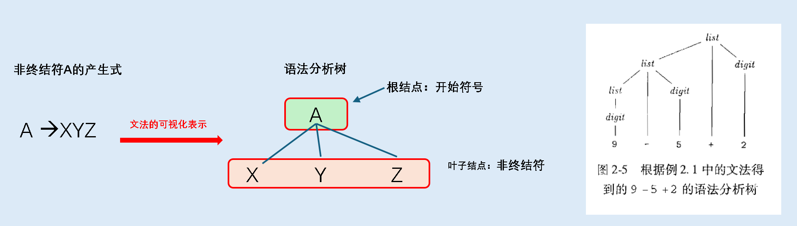
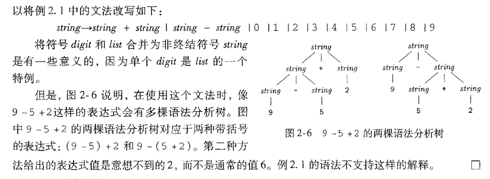
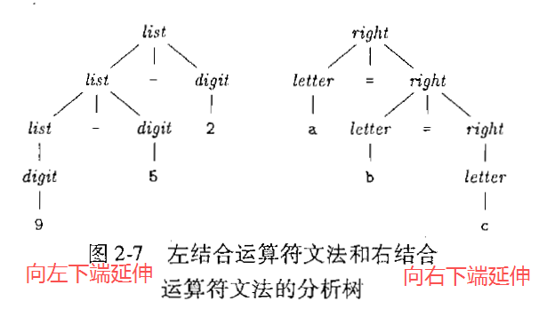
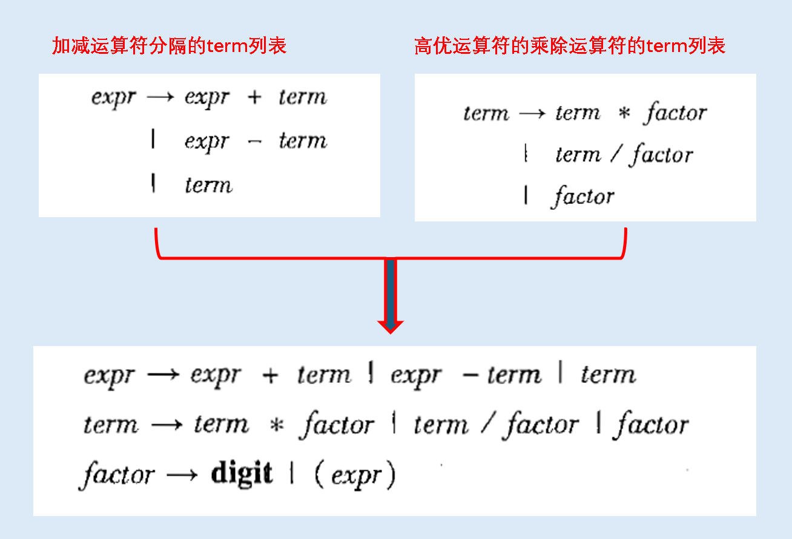
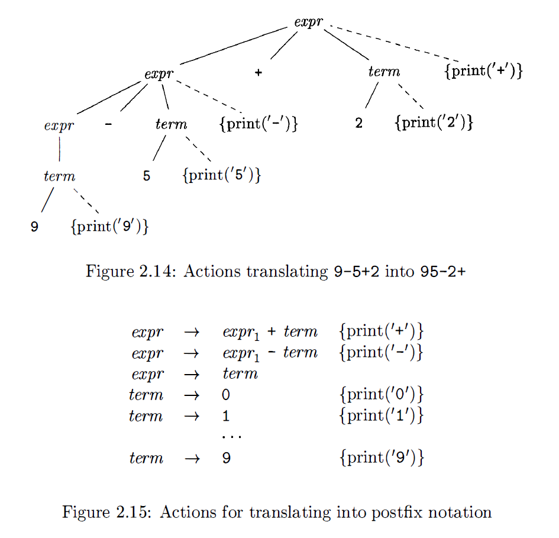
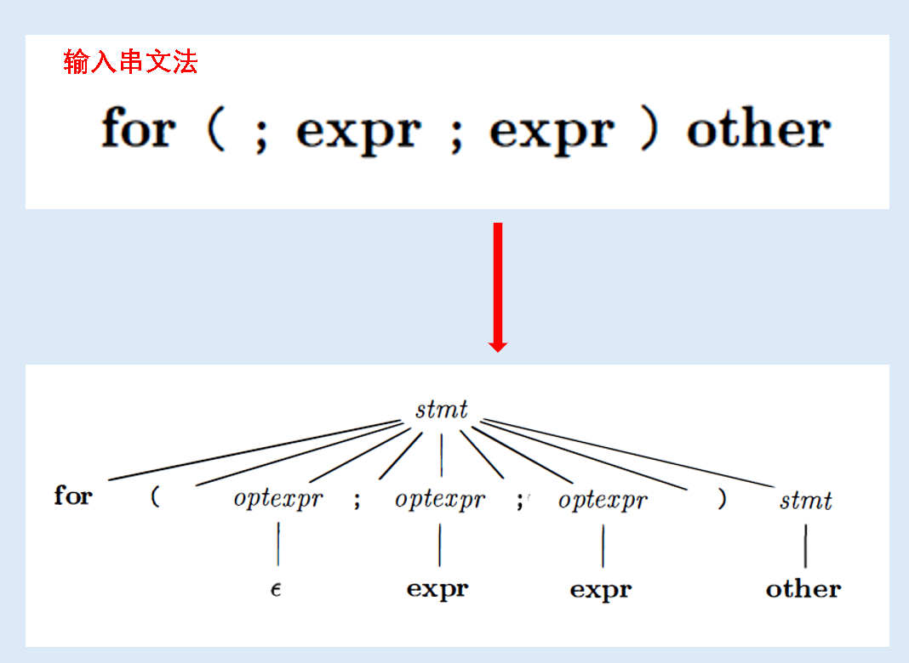
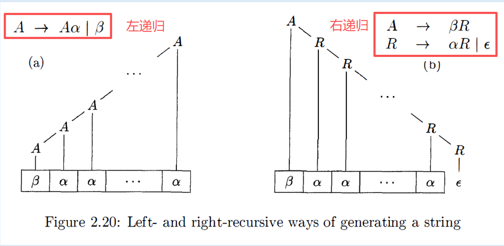
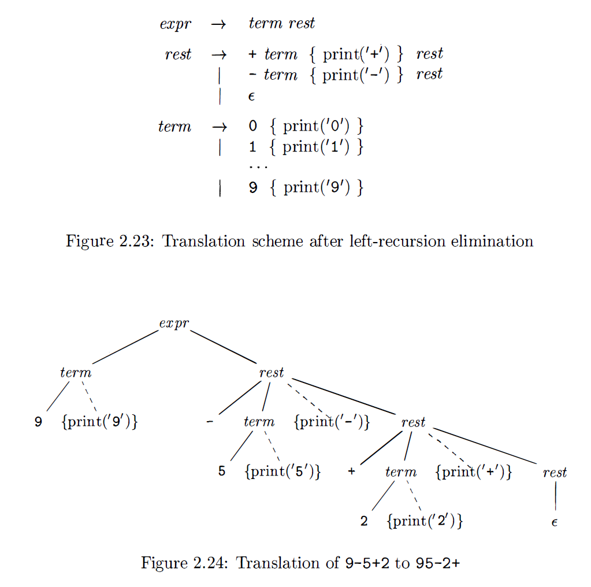

<h1 align="center">📒 Chapter02 一个简单的语法制导翻译器 学习笔记</h1>


## 1. 引言
编译器在分析阶段把一个源程序划分成各个组成部分，并生成源程序的内部表示形式。这种内部表示称为中间表示，然后编译器在合成阶段把中间代码翻译成目标程序。

一个程序设计语言的语法（syntax）则定义了该语言的程序的正确形式，语言的语义（semantics）则定义了程序的含义，即每个程序该运行时做什么事。

上下文无关文法不仅可以描述一个语言的语法，也可以指导程序的翻译过程。


## 2. 语法定义
用于描述程序设计语言语法的表示方法 --------- **上下文无关文法，简称文法**。文法自然地描述了大多数程序设计语言构造的层次化语法结构。


### 2.1 文法定义
**`上下文无关文法（context-free grammar，CFG）`** 用来描述编程语言的语法结构（如if-else、表达式优先级）。由四个元素组成：

- **终结符号 (Terminals)**： 有时也称为词法单元。
    - 构成输入串的基本符号的集合（如 +, *, id, num）。

- **非终结符号 (Nonterminals)**： 有时也称为语法变量。如expr、stmt。
    - 每个非终结符号表示一个终结符号串的集合。

- **产生式 (Productions)**： 描述如何从非终结符号推导出符号串。
    - 用于表示某个构造的某种书写形式。
    - 每个产生式包括一个称为产生式头或者左部的非终结符号。
    - 示例：形式为 $head \to body$，如 $stmt \to \textbf{if} ( expr ) stmt \textbf{ else } stmt$。

- **开始符号**：指定一个非终结符号。也是文法的入口。

在编译器中，词法分析器读入源程序中的字符序列，将序列组织为具有词法含义的词素，生成并输出代表这些词素的词法单元序列。


词法单元由两部分组成：

- 名字

    - 词法单元的名字是语法分析器进行`语法分析`时使用的`抽象符号`。一般把词法单元名字称为**终结符号**。

- 属性值
    - 这个值就是一个指向符号表的指针
    - 符号表中包含了该词法单元的附加信息。附加信息不是文法的组成部分。

在描述文法时，列出该文法的产生式，并先列出开始符号对应的产生式。

如果某个`非终结符号`是某个产生式的`头部`，则该产生式是该`非终结符号的产生式`。一个`终结符号串`是`零个`或`多个`终结符号组成的序列。`零个`终结符号组成的串称为`空串`。记为 $\epsilon$。

### 2.2 语法定义 --- 推导
将产生式看作重写规则，从开始符号出发，不断替换非终结符号，直到生成终结符号串。示例：

文法：$list \to list + digit \mid list - digit \mid digit$

推导 9 - 5 + 2：

$list \Rightarrow list + digit \Rightarrow list - digit + digit \Rightarrow digit - digit + digit \Rightarrow 9 - 5 + 2$

> 解析：
>
> - 因为9是digit，根据产生式 $list \to digit$ 可得 9 是list。
> - 因为5是digit，且9是list，根据产生式 $list \to list - digit$ 可得 9 -5 是list。
> - 因为2是digit，9-5是list，根据产生式 $list \to list + digit$ 可得 9 - 5 + 2 是list。

**语法分析（parsing）** 的任务：接受一个终结符号串作为输入，找出从文法的开始符号推导出这个串的方法。

一般情况下，一个源程序中会包含由多字符组成的词素，这些词素由词法分析器组成词法单元，而词法单元的第一个分量就是被语法分析器处理的终结符号。

### 2.3 语法分析树
**定义**：用图形方式展现从文法的开始符号推导出相应语言中的符号串的过程。（推导过程的图形化表示）

**基本结构**：

- 根节点：文法的开始符号。
- 叶子节点：终结符号或 $\epsilon$（空串）。
- 内部节点：非终结符号。



关于树型结构的术语（数据结构的知识点，可选择跳过）：

- 一棵树由一个或多个结点（node）组成。
    - 结点可以标号（编译器中称为文法符号）。

- 树有且只有一个根（root）结点。
    - 每个非root结点都有唯一的一个父（parent）结点。
    - root结点没父结点。
    - root结点就是顶层的结点。

- 如果结点N是结点M的父结点，那么M是N的子（child）结点。
    - 一个结点的各个子结点彼此称为兄弟结点。
    - 有序，排序方式为：从左到右。

- 没有子结点的结点称为叶子（leaf）结点。
    - 有一个或者多个子结点的结点，称为内部结点。

- 结点N的后代结点要么是N本身，要么是N的子结点，要么是N的子结点的子结点。
    - N是更深层结点的祖先结点。

总结：

- 文法的语言：所有能生成语法分析树的终结符号串的集合。

- 语法分析 (Parsing)：为给定的终结符号串构建语法分析树的过程。

### 2.4 二义性
**定义**：如果一个文法对同一个给定的终结符号串能产生两棵或者多棵不同的语法分析树，则该文法是 **二义性（ambiguous）** 的。



**注意：在编译器中必须消除二义性文法，一定要确保唯一的语义。**

### 2.5 运算符的结合性
使用一些规则来决定哪个运算符被用于该运算分量。

- **左结合：向左下端延伸**。

    - 运算从左向右进行（如 +, -, *, /）。
    - 示例：9-5-2 等价于 (9-5)-2。
    - 文法写法：使用`左递归`，$list \to list + digit$（list 在左边）。

- **右结合：向右下端延伸**。

    - 运算从右向左进行（如赋值 =，幂运算 ^）。
    - 示例：a=b=c 等价于 a=(b=c)。
    - 文法写法：使用`右递归`，$right \to letter = right$（right 在右边）。



### 2.6 运算符的优先级
表达式 `9 + 5 * 2` 会有两种情况：`9 + 5 * 2` 或 `(9 + 5) * 2`。如何解决二义性带来的问题？确保计算时一定优先计算乘法？

> 解决方案：使用算术优先级表来构建分层的文法。运算符一般会分为不同的层级，层级越深，那么对应的优先级越高。


分层方式：

- **Factor (因子)**：最基本单元（数字、括号表达式）。
    - 不能被任何运算符分开的表达式。
    - 因为在语法树最底部，最先被“抓住”，所以优先级最高。

- **Term (项)**：包含 乘法（*） 和 除法（/） 的表达式。
    - 可以被高优先级的运算符乘法（*） 和 除法（/）分开，但不能被低优先级运算符分开的表达式。
    - Term 由 Factor 组成。

- **Expr (表达式)**：包含 加法 和 减法 的表达式。

    - Expr 由 `Term` 组成。

**核心点：**

- 一个`表达式 (Expr)` 可以看作是由 `+` 或 `-` 分隔开的 `项 (Term)` 列表；而一个`项 (Term)` 又是由 `*` 或 `/` 分隔开的 `因子 (Factor)` 列表。

- 在语法树中，`表达式 (expr)` 产生式负责拆分 `+`，意味着 `+` 连接的是两个完整的 `term`。因此，term 内部的 `*` 运算会先被“打包”成一个整体，作为一个整体参与加法。

    > 示例：5 * 2 会被封装在一个 term 子树中，作为一个整体参与加法。

书中示例：



通过文法和分层方式进行分析：

- 正常方式：9 + 5 * 2
    - 入口是 expr。为了包含 +，必须先应用规则 1：expr -> expr + term。

    - 此时，表达式被强行拆分为：[9] + [5 * 2]。

    - 右边的 term 必须匹配 5 * 2，只能应用规则 2：term -> term * factor。

    - 总结：+ 在最顶层（最后算），* 在 term 内部（先算）。


- 括号改变优先级：(9 + 5) * 2
    - 入口是 expr。因为最外层操作是 *，只能匹配规则 1 的 expr -> term，然后 term -> term * factor。
    - 左边的 term 要匹配 (9 + 5)，最终会走到 factor -> ( expr )。
    - 括号里的 9 + 5 被保护在 factor 内部，作为一个整体参与外部的乘法。
    - 注意点：factor -> ( expr ) 就像一个传送门，它允许在最底层的 factor 里重新开始一轮 expr 的解析。

总结：Factor (因子) 是原子单位，要么是数字，要么是被括号保护起来的“完整体”。


## 3. 语法制导翻译
语法制导翻译（SDT）：通过向一个文法的产生式附加一些规则或者程序片段而得到。

语法制导翻译的两种方式：

- 语法制导定义 (SDD) - 属性（Attribute）：给节点附加属性，描述值之间的关系。
    - 属性：表示与某个程序构造相关的任意的量。

- （语法翻译的）翻译方案：将程序片段附加到一个文法的各个产生式上的表示法。
    - 主要用于将中缀表达式翻译成后缀表达式。也会用于表达式求值，并用来构建一些程序构造的抽象语法树。

### 3.1 后缀表示
一个表达式 $E$ 的后缀表达式（postfix notation）可以归纳定义为：

- 如果 $E$ 是一个变量或常量，则 $E$ 的后缀表示是 $E$ 本身。
- 如果 $E$ 是一个形如 $E_1$ op $E_2$ 的表达式。其中op是二目运算符，那么 $E$ 的后缀表示是：$E_1'E_2'op$。（$E_1'$ 和 $E_2'$ 分别是 $E_1$ 和 $E_2$ 的后缀表示）。
- 如果 $E$ 是一个形如$(E_1)$ 的 的被括号起来的表达式。则 $E$ 的后缀表示是 $E_1$ 的后缀表示。

示例： `(9  - 5) + 2` 的后缀表示：`95-2+`。

- 规则1：9 - 5 翻译为：`95-`。
- 规则3：(9 - 5) 就是括号括起来的本身。
- 规则2：(9 - 5) 是$E_1$，2是$E_2$，所以得到：`95-2+`。

示例：后缀表示：`952+-3* `则逆推表达式为：`(9 - (5 + 2)) * 3`

- 先从左边开始，加号旁边优先。运算分量 `(5 + 2)`作为一个整体，就是 `97-3*`。
- 规则2：`97-3*` 逆推为 `(9 - 7)` 作为一个整体，则 `23*`。
- 规则2: `23*` 就是 `2 * 3`。

### 3.2 语法制导定义 (SDD) - 综合属性
语法制导定义：

- 每个文法符号（非终结符号或终结符号）和一个属性集合相关联。
- 每个产生式和一组语义规则相关联。规则用于计算与该产生式中符号相关的属性值。

> 注意点：一个结点的属性值仅依赖于其子结点的属性值。

如果一棵语法分析树的各个结点上标记了相应的属性值，则称这棵语法分析树成为 **`注释语法分析树（简称：注释分析树）`** 。

如果某个属性值在语法分析树结点N上的值是由N的子结点以及N本身的属性值确定，则这个属性称为 **综合属性（synchronized attribute）**。

> 性质：只需要对语法分析树进行一次 **自底向上** 的遍历，即可计算出属性的值。
>
> **自底向上遍历** ：在计算完成某个结点的所有子结点的属性值之后才计算该结点的属性值的过程。

### 3.3 简单语法制导定义
性质：

- 要得到代表产生式头部的非终结符号的翻译结果的字符串，只需要将产生式体中各非终结符号的翻译结果按照它们在非终结符号中的出现顺序连接起来，并在其中穿插一些附加的串。

- 总结：在定义中出现的顺序打印附加的串即可。


### 3.4 树的遍历
树的遍历：用于描述属性的求值过程，以及描述一个翻译方案中的各个代码片段的执行过程。

**深度优先搜索（DFS）**：遍历从根结点（root）开始，通过递归的方式，尽可能地访问一个离根结点最远的结点（即最深的结点）。主要有三种遍历顺序：

- **前序遍历 (Preorder Traversal)**：先访问根结点，再访问子结点。

- **中序遍历 (Inorder Traversal)**：在访问左子树后、右子树前处理当前节点（仅限二叉树）。

- **后序遍历 (Postorder Traversal)**：在访问完所有子节点后处理根结点。

语法制导定义没有规定一棵语法分析树中各个属性值的求值顺序。


DFS的案例伪代码：

```c
procedure visit(node N) {
    for (从左到右遍历N的每个子结点C) {
        visit(C);
    }

    按照结点N上的语义规则求值
}
```

### 3.5 翻译方案

- 定义：

    - **语法制导定义（SDD）**：将字符串作为属性值附加在语法分析树的结点上，从而得到翻译结果。

    - **语法制导翻译方案（SDT）**：一种在文法产生式中附加一些程序片段来描述翻译结果的表示方法。

    - 区别：SDD 关注“计算什么”（**规则**），翻译方案关注“何时计算”（**过程**）。

- 语义动作
    - 被嵌入到产生式的任意位置的程序片段。
    - 用花括号括起来，并写入到产生式中，执行位置也由此确定。

- 执行方案
    - 为每个语义动作构造一个额外的**叶子结点（虚结点）**
    - 使用 **深度优先（DFS）** 的方式去遍历语法树
    - 当遍历到这个 “语义动作” 时，就立即执行该动作。

- 案例：将中缀表达式翻译成后缀形式的语义动作
    - 目标：将 `9 - 5 + 2` 翻译为 `9 5 - 2+`。

    - 为了实现后缀输出，操作符必须在操作数之后打印。因此，打印动作 `{ print(op) }` 必须放在产生式的最右端。

    - **文法与语义动作**：

        $expr \to expr_1 + term \ \{ \textbf{print('+')} \}$

        $expr \to expr_1 - term \ \{ \textbf{print('-')} \}$

        $term \to 0 \dots 9 \ \{ \textbf{print(digit)} \}$
    
    - 遍历执行流程：
        - 访问 $expr$ $\rightarrow$ 递归访问 $expr_1$ $\rightarrow$ 0 ... 9 $\rightarrow$ 打印 9 $\rightarrow$ 打印 5 $\rightarrow$ 回溯到规则2 $\rightarrow$ 执行 { print('-') } $\rightarrow$ 打印 2 $\rightarrow$ 回溯到规则1 $\rightarrow$ 执行 { print('+') }。

    


## 4. 语法分析
**语法分析**：决定如何使用一个文法生成一个终结符号串的过程。

> 接受一个词法单元流（Token Stream），验证其是否符合文法，通过语法分析去构造语法分析树（或直接执行翻译动作）。

大多数语法分析方法中有`两种`语法分析树结点的构造顺序：

- **自顶向下（Top-down）** 方法
    - 构造过程从`根结点开始`，逐步向叶子结点方向进行。

- **自底向上（Bottom-up）** 方法
    - 构造过程从`叶子结点开始`，逐步构造出根结点。

从`文法生成语法分析树`的软件工具常常使用`自底向上`的方法。

### 4.1 自顶向下分析方法
在构造语法分析树时，执行两个步骤如下：

- 从语法分析树的`根节点（开始符号）`开始。

- 按照“从左向右”的顺序，不断尝试匹配输入。
    - 一般使用语法分析树中的最左边的子树来构造尚未扩展的非终结符。

对于某些文法，两个步骤只需要对输入串进行一次从左到右的扫描即可完成。

**执行动作**：在树的某个节点 $A$ 处，如果有多条产生式 $A \to \alpha \mid \beta$，则选择一条分支结点向下生长来构造子树。

输入串文法到语法分析树的过程：



- 输入中当前被扫描的终结符号通常称为 **预读（lookahead）** 符号。
- 在开始时，向前看符号是输入串的 **第一个（最左边）** 终结符号。

一般来说，为一个非终结符号选择产生式是一个 “尝试并犯错” 的过程：

- 先选择一个产生式，并在产生式不合适是进行回溯，在产生另一个产生式。
    - 不合适的标准：在使用产生式后，无法构造得到一棵与当前输入串相匹配的语法分析树。

### 4.2 预测分析法
**递归下降分析方法（Recursive-descent Parsing）**：一种**自顶向下**的语法分析树，使用一组 **递归过程** 来处理输入。**预测分析法（predictive parsing）** 是一种简单形式之一。

> 预测分析法中，各个非终结符号对应的过程中的控制流可以有`预读（lookahead）符号无二义性确定`。

在两个产生式 $A \to \alpha$ 和 $A \to \beta$，必须考虑相应的FIRST集合。在不考虑 $\epsilon$ 产生式，**预测分析法** 要求 $FISRT(\alpha)$ 和 $FIRST(\beta)$ **不相交**，就可以用`预读符号（lookahead）`来确定使用哪个产生式。


### 4.3 何时使用 $\epsilon$ 产生式？
预测分析器在没有其它产生式可用时，将 $\epsilon$ 产生式作为默认选择使用。但是如果遇到如果当前符号不匹配任何显式的产生式，我该报错还是尝试“空（$\epsilon$）”？

> 直接不报错，什么也不做的直接返回。

使用规则：只有当当前预读符号不在其他非空产生式的“FIRST集合”中，且该非终结符允许推导为空时，才选择 $\epsilon$ 分支。

### 4.4 设计一个预测分析器
预测分析法的一个重要性质：***对于文法的任何非终结符号，它的各个产生式体的FIRST集合互不相交***。

预测分析器程序由各个非终结符对应的过程组成。所以对于非终结符A来说，只要三个基本的步骤：

- **检查预读（lookahead）符号**：断并确定使用A的哪个产生式分支。
- **检查和匹配终结符**：模拟被选中产生式的体，检查执行每个产生式体的符号。如果在某个过程中，产生式体中的终结符号和预读符号不匹配，则语法分析器报错一个语法错误。
- **递归调用**：对于产生式中的非终结符，调用该非终结符号对应的子程序。

检查是否匹配的函数伪代码：

```c
void match(terminal t) {
    if (lookahead == t) lookahead = nexTerminal;
    else report("Syntax error");
}
```

### 4.5 左递归
递归下降语法分析器有可能出现致命问题：死循环（无限循环）。

- 文法：$expr \to expr + term \mid term$
- 解析 $expr$ 时，第一步就是调用 $expr()$，这会导致无限递归（栈溢出）。
- 辨别方式：形如 $A \to A\alpha$ 的产生式都是直接左递归。

如何解决这个死循环的问题呢？

- 将左递归改为右递归。

- 通用公式：

    - 原：$A \to A\alpha \mid \beta$

    - 新：$A \to \beta R$ 且 $R \to \alpha R \mid \epsilon$

        - $R \to \alpha R $ 是右递归，产生式的右部的最后一个符号是R本身。也就是向右下生成的子树。




## 5. 简单表达式的翻译器
- 目前的矛盾点：

    - 一方面，需要一个能够支持翻译规约的文法。
    - 另一方面，有需要一个明显不同的能够支持语法分析过程的文法。

- 解决方法：

    - 首先使用易于翻译的文法，然后再小心地进行文法转换，使之能够支持语法分析。

### 5.1 抽象语法和具体语法

- **抽象语法树 (Abstract Syntax Tree, AST)**：也简称语法树。

    - 内部结点代表程序构造。语法分析树中，内部结点代表非终结符号。
    - 在抽象语法树中，丢弃了这些辅助性质的非终结符号。
    - 只保留了操作符和操作数之间的关系。

- **具体语法树 (Concrete Parse Tree)**
    - 有时把语法分析树也成为具体语法树。其对应的文法则称为语言的具体语法。
    - 显式地表现了文法的所有细节（包括为了消除二义性、左递归而引入的各种非终结符等问题）。
    - 缺点：结构比较冗余，但在解析阶段必须严格遵循。


### 5.2 调整翻译方案
- 左递归消除技术的文法：$expr \to expr + term \mid term$ 
- 使用右递归之后的文法：$A \to \beta R$ 且 $R \to \alpha R \mid \epsilon$

调整翻译的过程：



- 语义动作也要跟着非终结符号一起移动。
- 在右递归文法中，+ 是在 rest 产生式里出现的，所以打印 + 的动作也必须移入 rest：

    - $rest \to + \ term \ \{ \text{print('+')} \} \ rest_1 \mid \epsilon$

    - 如果 语义动作 放在rest后，翻译就会不正确。

注意：左递归消除时要小心，确保消除后的结果保持语义工作的顺序。

### 5.3 非终结符号的过程

对于Figure 2.23 的语法制导翻译方案的实现伪代码如下：

```c
void expr() {
    term(); rest();
}
void rest(){
    if ( lookahead == ' +' ) {
        match('+') ; term(); print('+'); rest();
    }
    else if ( lookahead == ' -' ) {
        match(' -') ; term(); print(' -'); rest();
    }
    else { } /* dp nothing with the input */ ;
}
void term(){
    if ( lookahead is a digit ) {
        t = lookahead; match ( lookahead ) ; print ( t) ;
    }
    else report (" syntax error" );
}
```

- 对于非终结符（expr、term、rest）在代码中都是一个函数。
- 对于 `rest()` 函数，会观察 lookahead 属性值。如果是 `+` 或 `-`，进入对应分支；否则，进入 $\epsilon$ 分支（即：什么都不做）。


### 5.4 翻译器的简化

对上述的代码做优化，简化把过程rest展开到过程expr中。

> 翻译具有多个优先级的表达式时，简化处理可以减少需要使用的过程数目。


直接不需要真的去调用 `rest()` 函数，而是使用一个 `while(true)` 循环。

```c
void rest(){
    while( true ) {
        if( lookahead == '+' ) {
            match('+') ; term(); print ('+') ; continue;
        }
        else if ( lookahead == '-' ) {
            match(' -') ; term(); print('-') ; continue;
        }
        break ;
    }
}
```

- 某些递归调用可以替换为迭代。
- 对于没有参数的过程，尾递归调用替换为跳转到过程开头的语句，

    > **尾递归（tail recursive）**：一个过程中执行的最后一条语句是对该过程的递归调用。

- 从判断逻辑变成循环逻辑：只要看到 `+` 或 `-`，就消费它，匹配 term，打印符号，然后继续循环。可以提高了程序的运行效率。


## 6. 词法分析
**词法分析器的任务**：从源程序中读取字符流，将其组成词法单元对象，输出对应的词法单元，然后输入给语法分析器使用。

> **词法单元**：一个带有附加信息的终结符号。
> 
> **词素（lexem）**：构成一个词法单元的输入字符序列。
>
> 词法分析器让语法分析器不需要考虑词法单元的词素表示方法。

### 6.1 移除空白和注释
- 原因

    - 大部分语言允许词法单元之间出现任意数量的空白，在语法分析过程中也会忽略源程序代码中的注释，所以注释也可以当空白进行处理。

        > 大量的空格、制表符（\t）和换行符（\n）也需要处理。

- 如何实现

    - 词法分析器的代码中，使用循环的方式，遇到空格、制表符或者换行符时不断读取输入字符，跳过对应的符号。

- 一般也会维护一个变量line，统计输入中的换行符或者其他符号的个数，用于定位错误信息。

```c
for (;; peek = next input character) {
    if (peek is a blank or a tab) do nothing;
    else if (peek is a newline) line = line + 1;
    else break;
}
```

### 6.2 预读

- 为什么需要预读？？
    - 在决定向语法分析器返回哪个词法单元之前，词法分析器可能需要预先读入下一个字符。

    - 案例：比较运算符

        - 读取遇到字符 >，不确定是“大于”还是“大于等于”的前半部分。
        - 必须预读下一个字符。如果是 =，则是 >=；否则就是 >（此时需要把多读的字符“退回”给输入流）。
            - 缓冲区：指针回移策略

- 缓冲区：指针回移策略
    - 读取方式：词法分析器使用一个输入指针来跟踪当前处理的字符。
    - 多读一个：当看到 > 时，分析器会多读一个字符。
    - 回移指针：如果多读的是 a（即 > a），分析器意识到 a 不属于当前 Token，此时必须**回移指针（Pointer Retraction）**。

    - 经典案例：指针操作。


- peek变量的作用

    - **暂存“预读但未使用”的字符**：当词法分析器返回一个词法单元时，要么保存当前词法单元的`词素后`的那个字符，要么保存空白符。

### 6.3 常量
当输入流中出现一个整数数位序列时，词法分析器将向语法分析器传送一个词法单元。

> 词法单元（Token）包含：
> 
> - 终结符号Num标记类型
> - 存储数值的属性值（Value）。

伪代码实现：

```c
if ( peeks holds a digit ) {
    v = 0;
    do {
        v = v * 10 + integer value of digit peek;
        peek = nex input character
    } while ( peek holds a digit )
    return token <num, v>;
}
```

- 初始化 v = 0。
- 只要遇到数字字符 d，执行 v = v * 10 + (d - '0')。
- 循环结束，返回值为 v 的 Num 对象。

### 6.4 识别关键字和标识符
- 相同点
    - 关键字和标识符在形式上都是`以字母开头、后接字母或数字`的字符串。

- 把标识符当作终结符号进行处理。关键字也可以使用标识符的组成规则，但词素什么时候组成一个关键字，什么时候组成一个标识符呢？？

- 解决冲突方案：符号表

    - 伪代码实现：

    ```c
    if ( peek holds a letter ) {
        // 1. 收集：只要后续是字母或数字，就存入缓冲区 b
        collect letters or digits into a buffer b;
        s = string formed from the characters in b;

        // 2. 查表：在 words 表（符号表）中查找该字符串 s
        w = words.get(s);

        // 3. 判断：
        if ( w is not null ) return w; // 如果查到了，说明是预存的【关键字】
        else {
            // 如果没查到，说明是一个新出现的【标识符】
            // 4. 存入：将新标识符存入 words 表，方便下次快速识别
            Enter the key-value pair (s, <id, s>) into words;
            return token <id, s>;
        }
    }
    ```

## 7. 符号表
**符号表（symbol table）**：一种供编译器用于保存有关源程序构造的各种信息的数据结构。

> 在编译器的分析阶段将这些信息收集后放入符号表中，在综合阶段用于生成目标代码。

- 符号表的每个条目包含一个与标识符相关的信息。
- 符号表通常需要支持同一标识符在一个程序中的多重声明。

`符号表条目`是在`分析`阶段由`词法分析器`、`语法分析器`和`语义分析器`创建并使用。

### 7.1 为每个作用域设置一个符号表
**作用域（scope）**：一个或者多个声明起作用的程序部分。

- 程序块结构：判断语句（`if ... else ...`）和 循环语句（`for() {}`）等。
- 变量名的嵌套：`{ int x; ... { int x; ... } }`。内层的 x 和外层的 x 是两个不同的变量。

块的符号表的实现利用作用域的 **最近嵌套规则** 。

- **最近嵌套规则**
    - 一个标识符x在最近的x声明的作用域中。从x出现的块开始，从内向外检查各个块时找到第一个对x的声明。

- 使用链式符号表：使得内嵌语句块的符号表指向外围语句块的符号表。


### 7.2 符号表的使用
符号表的作用：将信息从声明的地方传递到实际使用的地方。

## 8. 生成中间代码
- 前端：将源程序的中间表示构建。
- 后端：将中间表示生成目标程序。

### 8.1 两种中间表示形式
编译器的前端会输出的中间表示形式，一般有两种：

- **树型结构**：
    - 包括语法分析树（具体分析树）和抽象语法树（AST）

    - 有层次化的结构，便于分析。

- **线性表示形式**：
    - 三地址代码
        - 编译器可以在创建抽象语法树的同时生成三地址代码序列。

    - 没有层次化的结构，将组成程序的三地址语句序列分别为“**基本块**” 的方式去逐个指令执行。
        - 基本块：一个总是逐个顺序执行的语句序列，执行时不会出现分支跳转。

编译器在分析过程中只会保存将用于语义检查或者其他目的的结点及其属性，也保存了用于语法分析的数据结构，但不会保存整棵抽象语法树。

### 8.2 语法树的构造
后续两个章节会细致讲解：

- 第五章 语法制导翻译
- 第六章 中间代码生成

### 8.3 静态检查
- 定义
    - 在编译过程中完成的各种一致性检查，在程序运行前发现编程错误。包括：
        - 语法检查
        - 类型检查

- 左值 (L-values) 和 右值 (R-values)：
    - 出现赋值表达式左部和右部。赋值语句：`L = R`。
    - 左值 (L-values)：存储位置（内存地址）。
    - 右值 (R-values)：存储一个值（内容）。

- 如何检查？
    - 赋值表达式的左部表示是一个左值。
    - 类型检查：确保一个构造的类型符合上下文对其的期望。
        - 自动类型转换
        - 重载

### 8.4 三地址码
- 三地址代码的格式：`x = y op z`，一条指令中最多包含三个操作数。

- 语句的翻译

    - 利用跳转指令实现语句内部的控制流。将语句转为三地址代码。

- 表达式的翻译
    - 简单的方法：为一个表达式的语法树中的每个运算符结点都生成一个三地址指令。
