<h1 align="center">📒 Chapter06 中间代码生成 学习笔记</h1>

## 0. 概述

对于一个编译器可能构造出一些列的中间表示（IR）：

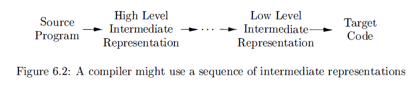


- **高层 IR (High-level IR)**
    - 接近于源语言，保留语法结构（如 AST），适用于源语言相关的静态检查。
    - 三地址代码既是高层IR的表示形式，也是低层IR的表示方式。

- **中层 IR (Medium-level IR)**
    - 真正的语言，可以由编译器的各个处理阶段共享的多个内部数据结构组成。
    - 独立于机器但结构简单（如 TAC, SSA），是后端优化的主要阵地。
    - C语言也常被用作中间表示。

- **低层 IR (Low-level IR)**
    - 接近机器指令（如带虚拟寄存器的汇编），适用于寄存器分配和指令调度。

## 1. 语法树的变体
**无环有向图（Directed Acyclic Graph， DAG）**：指出表达式中的`公共子表达式`（多次出现的子表达式）。

### 1.1 表达式的有向无环图
DAG是语法树的优化版本，一个DAG的叶子结点对应原子运算分量，而内部结点对应于运算符。与语法树的区别：

- 语法树
    - 结构与表达式语法一一对应，重复的子表达式会多次出现。
- DAG
    - 如果DAG中一个结点N表示一个公共子表达式，则N可能有多个父结点。
    - 代表同一值的节点会被共享。例如 `a + a` 在 `DAG` 中只有一个 `a` 节点。
    - 简洁表示表达式，可以为最终生成表达式的高效代码提供信息。

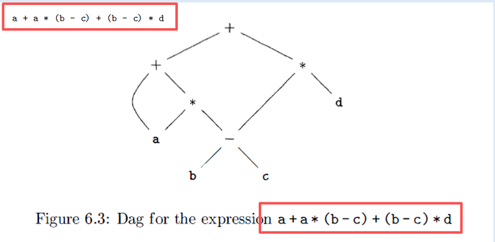

- 识别叶子结点
    - 变量 a, b, c, d。

- 子表达式共享：

    - 首先计算 `(b - c)`，该结点被后续两个乘法操作共同引用。

    - 注意变量 a 虽然出现了两次，但在 DAG 中只作为一个叶子节点存在，被加法和乘法共同引用。

- 语法树和DAG的对比：

    - 语法树：会有 10 个节点（含重复的 b-c 和 a）。

    - DAG：仅需 6-7 个节点，结构上 b-c 节点的入度为 2。

- 优化点：

    - 空间节省：减少中间表示的节点数。

    - 求值优化：编译器只需计算一次公共子表达式，后续直接引用结果。


### 1.2 构造DAG的值编码方式
语法树或者DAG中的结点通常放在一个记录数组中。数组的每一行表示一个记录，也就是结点，每个记录中，第一个字段是一个运算符代码，也就是结点的标号。


值编码：给一个结点对应的记录在此数组中的整数下标就可以引用该结点。这个整数就是结点的唯一值编码。

> - 为每个节点分配一个唯一标识（值编码）。
> 
> - 可以用记录指针或对象引用来代替整数下标。

算法：构造DAG的结点的值编码方法。

- 输入：标号op、结点l和结点r
- 输出：在数组中具有三元组 `<op, l, r>` 形式的结点的值编码。
- 实现方法：使用散列表（Hash Table）。
    - 在数组中搜索标号为`op、左子结点为l且右子结点为r的结点M`。
        - 如果存在结点M，就返回M结点的值编码。
        - 如果不存在，则在数组中添加一个新结点N，其标号为op，左右子结点分别为l和r，然后返回新建结点对应的值编码。


## 2. 三地址代码
三地址代码中，一条指令的右侧最多有一个运算符。不允许出现组合的算术表达式。

三地址代码是一棵语法树或一个DAG的线性表示形式。


### 2.1 地址和指令
三地址代码基于两个概念：**地址和指令**。

- 地址的形式：名字、常量、编译器生成的临时变量。
- 常见的指令：赋值、复制、无条件跳转 (goto)、条件跳转 (if-goto)、过程调用和返回 (param/call/return)。

### 2.2 四元式表示
**四元式（quadruple）** 有四个字段：`op, arg1, arg2, result`。字段op包含一个运算符的内部编码。

> 四元式显式地为每一个中间步骤创建临时变量（如 $t_1, t_2$）

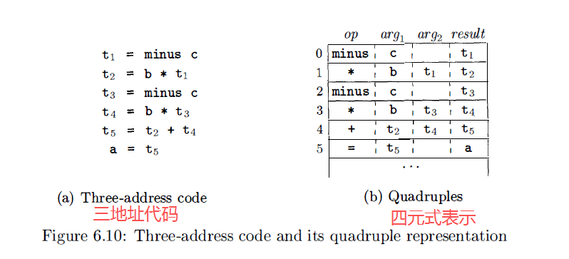

- 特点
    - 独立存储结果名。
    - 方便指令调度，不会因为指令顺序的改变，影响引用的关系。指令顺序不影响引用的使用。


```markdown
[ 内存地址 ]    [ op ]    [ arg1 ]    [ arg2 ]    [ result ]
     100:      minus        c          ---          t1  <-- 结果独立存储
     104:        * b        t1         t2  <-- 引用结果名
```

四元式类似身份证的信息，在数据库中查找时，只要根据你的身份证号去查找，不管你的身份证在数据库中什么顺序位置，有一个唯一的引用不会改变。

### 2.3 三元式表示
**三元式（triple）** 有三个字段：`op, arg1, arg2`。类似排队的过程中，要找的第一个人如果发生变化，那么就排队顺序都要改变。

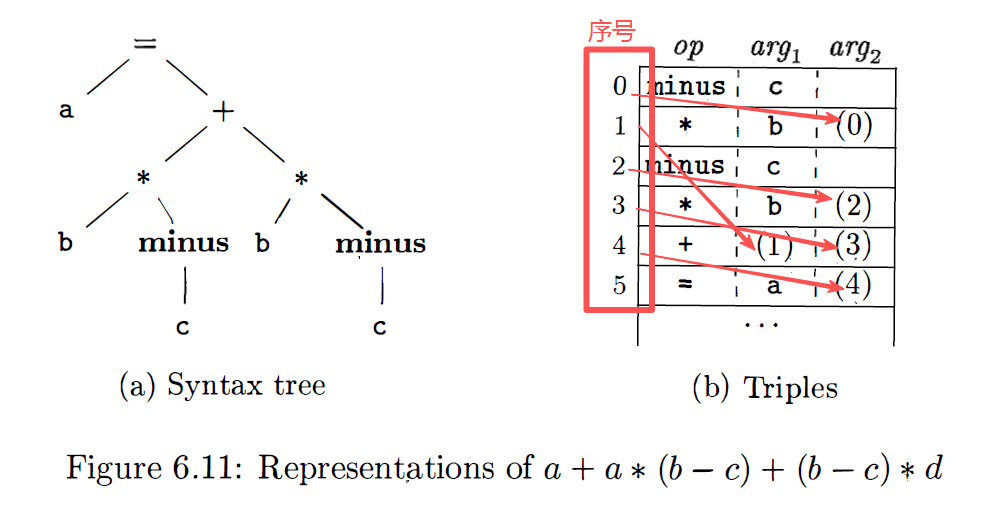

```markdown
[ 指令编号 ]    [ op ]    [ arg1 ]    [ arg2 ]
     (0):      minus        c          ---
     (1):        * b        (0)  <-- 指向(0)的物理位置
     (2):      minus        c          ---
```

- 三元式没有和四元式中一样，三元式没有临时变量名，它用括号里的数字 (x) 代表第 x 条指令产生的结果。

- 引用依赖于位置，移动指令非常困难（通常用于不需要复杂优化的场景）。
    - 如果想把第 (0) 行和第 (2) 行交换位置，所有引用了 (0) 的后续指令（如第 1 行）都必须全部修改引用编号。

### 2.4 间接三元式
**间接三元式（indirect triple）**：一个指向三元式的指针的列表，而不是列出三元式序列本身。


- 使用间接三元式时，优化编译器会通过对 instructions 列表的重新排序来移动指令的位置，不会影响三元式本身。
- 解决三元式的指令位置不能随意移动的弊端。


### 2.5 四元式、三元式、间接三元式的比较
|比较项|四元式|三元式|间接三元式|
|--|--|--|--|
||||||

**面试题：为什么生产环境中多用四元式？**

> 因为代码优化（如循环外提、指令重排）需要频繁移动代码位置。四元式通过变量名解耦，而三元式与物理位置强绑定，维护成本太高。

### 2.6 静态单赋值形式（SSA）
**静态单赋值形式（SSA）**：一种中间表示形式。有利于某些类型的代码优化。


SSA和三地址代码的区别：

- SSA中每个变量只有唯一的一次赋值定义。
- 三地址代码（TAC）中代码变量的复制不具备唯一性。随时可变。

$\phi$ 函数 (Phi-functions)：处理控制流汇合点。

**SSA的经典应用：简化常数传播和死代码消除算法。**


## 3. 类型和声明
把类型的应用划分为：

- 类型检查
    - 利用一组逻辑规则来推理一个程序在运行时的行为。
    - 保证运算分量的类型和运算符的预期类型相匹配。

- 翻译
    - 编译器根据名字的类型来确定名字在运行时需要多大的存储空间。

### 3.1 类型表达式
类型本身也是一种据结构，使用 **类型表达式** 来表示。

类型表达式的定义：

- 基本类型
    - 语言的基本类型：`boolean`、`char`、`integer`、`float`和`void`。

- 类名
- 类型构造符

    - 数组 (Array)

    - 记录 (Record)：字段名和对应的类型的一个构造。例如：结构体。

    - 指针 (Pointer)

    - 函数 (Function)：$s \to t$（从类型 $s$ 到 类型 $t$ 的函数）。

**图是表示类型表达式的一种方法**。

### 3.2 类型等价
当编译器要检查 `x = y` 是否相等时，就必须判断 `x` 和 `y` 的`类型`是否相同。


- **结构等价（Structurally Equivalent）** 的定义规则：

    - 相同的基本类型（Basic Type）。
        - 两个类型如果都是 int，或者都是 float，两个自然是一样的。
    - 通过将相同的类型构造符（Constructor）应用于结构等价的类型而形成的。
        - 两个数组 A 和 B 要满足结构等价的规则：
            - 构造符相同：都是“数组”。
            - 参数等价：成员类型都是 int。

    - 一个类型是另一个类型表达式的名字。
        - 典型案例：类型别名 `typedef`
            - `typedef int MyInt`;，那么 `MyInt` 和 `int` 就是等价的。


- **名等价 (Name Equivalence)** 的规则：
    - 仅当两个类型的`名字完全相同`时才相等。
    - 编译器在对比类型时，只看名字，不看名字后面藏着的内容。
    - 案例：若定义 `type A = array(10, int)` 和 `type B = array(10, int)`，A和B两个不同的名字，在名等价规则下，A 和 B 不相等。

### 3.3 声明
处理基本类型和数据类型的文法规则：

$D \to T \quad id : D| \epsilon$

$T \to B \quad C \, | \, record \quad \'\{' D '\}'$

$B \to int \:|\: float$

$C \to \epsilon \: | \: [num] \: C$

- D非符号终结符生成声明。
- T 生成基本类型、数组类型或者记录类型。
- B 生成基本类型 int 和 float 之一。
- C（表示分量）产生零个或者多个整数，每个整数用方括号括起来。

### 3.4 局部变量名的存储布局
- 编译器在处理变量声明时，通过变量类型确定变量在运行需要的内存数量，从而确定为每个变量名分配一个相对地址。

    - 类型名和相对地址信息保存在符号表条目中。
    - 对于字符串的变长数据、动态数组等是在运行时才能确定，所以一般是直接指向数据的指针，这个指针会占用一块固定大小的内存区域。


- **地址对齐**

    - 存储布局受目标机器的寻址约束的影响。
    - 因对齐要求而分配的无用空间称为 “补白”。
    - 当空间宝贵时，编译器就需要对数据进行压缩（不存在无用空间），但在运行时需要额外的指令时就需要对压缩的数据进行重新定位，从而达到对齐要求后进行指令运算。

- 字节是可寻址的最小内存单位。
    - 一个字节通常有7个二进制位。
    - 多字节数据会存在一个连续的字节中。

- **宽度 (Width)**：类型占用的字节数。
    - `int`: 4字节, `float`: 8字节, `char`: 1字节。
    - 数组的宽度：数组元素的个数 * 单个数组元素的宽度。

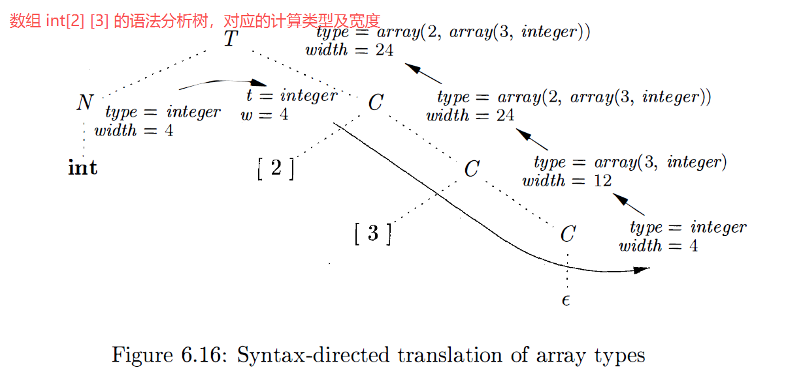


### 3.5 声明的序列
**偏移量 (Offset)**：变量相对于内存区域起始位置的距离。


文法通常为：$P \to D$ (程序由声明组成)，$D \to D ; D$ (声明序列)。

- 语义动作：

    - 在处理一串声明时，必须将当前的 `offset` 值在产生式之间传递（通常作为继承属性）。

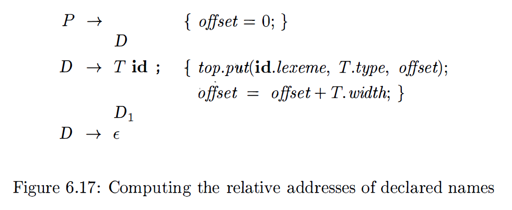


### 3.6 记录和类中的字段
为了处理记录，文法的产生式：

$T \rightarrow \text{record} '\{' D '\}'$

$D \rightarrow T \ id ; D \mid \epsilon$

> $D$ 代表记录内部的声明序列。


在表示记录类型时，要注意两个规则：

- 一个记录中各个字段的名字是互不相同。
    - 在由D生成的声明中，同一个名字最多出现一次。

- 字段名的偏移量
    - 相对地址，是相对于该记录的数据区字段来说的。

**记录类型** 是一个专用的符号表，对其各个字段的类型和相对地址。记录（Struct）和类有自己的独立作用域。

在翻译记录类型的产生式时，有两个语义动作：

> 翻译记录类型时，重点在于Env的切换。

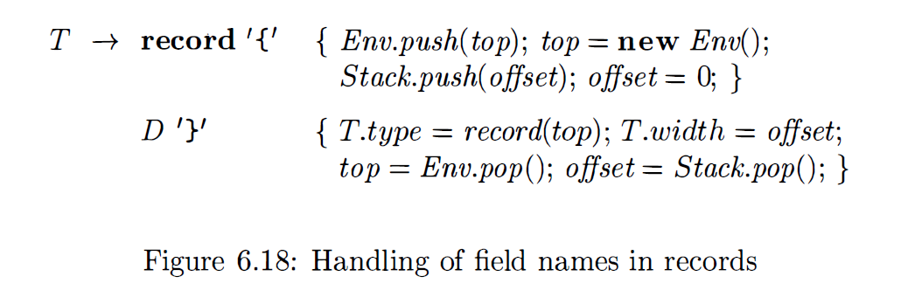

- 编译器遇到 `record` 时，使用一个栈来保存当前的符号表。进入记录时，将当前符号表 `top` 压`入栈`，并创建一个`新的空表`作为新的 `top`。

    - 保存当前 `offset` 值，并将 `offset` 重置为 `0`。

- $D$ 生成的声明将类型和相对地址保存到新的符号表中。$D$声明中使用 `top` 创建一个记录类型，恢复最早存好的符号表和`offset`。

进入结构体定义时，必须开启一个新的 `Env（符号表环境）`，并将 `offset` 重置为 `0`。结构体处理结束后，`整个结构体的宽度 = 最终的 offset`。


**语义动作 (SDT) 详细步骤**

- 进入记录前：

    - 保存当前环境 top。

    - 保存当前偏移量 offset。

    - 将 offset 设置为 0。

- 处理内部声明 $D$：

    - 对于每一个 $T \ id;$，在当前的 top 表中记录 `id.type = T.type` 和 `id.offset = offset`。

    - 更新 `offset = offset + T.width`。

- 退出记录时：

    - 记录类型的语义值被设定为 `record(top)`，其中 top 包含了所有字段的列表。

    - 记录类型的总宽度设定为当前的 `offset`。

    - 恢复环境：`top` 设为之前保存的`旧表`。

    - 恢复偏移量：`offset` 设为之前保存的`旧值`。


## 4. 表达式的翻译
使用三地址代码的方式翻译表达式。

### 4.1 表达式中的运算
使用 $S$ 的属性 $code$ 以及表达式 $E$ 的属性 $addr$ 和 $code$，为一个赋值语句 $S$ 生成三地址代码的语法制导定义如下：


- E.addr：存放表达式 $E$ 值的地址（可以是`变量名`、`常量`或者编译器产生的`临时变量`）。

- gen(...)：生成三地址指令的辅助函数。
    - $gen(x \ '=' \ y \ '+' \ z)$ 表示三地址指令：$x = y + z$。当被传递给gen时，变量 $x$ 、$y$、$z$ 的位置上出现的表达式将首先被求值。而 引号$'='$ 内的字符串则按字面值传递。

针对 $`E \rightarrow E_1 + E_2`$ 的例子：

- 为结果分配一个新的临时变量 `E.addr = new Temp()`。

- 生成代码：`gen(t '=' E1.addr '+' E2.addr)`。

- 传递地址：`E.addr = t`。

产生式 $S \to id = E$ 的语义规则：使用函数 `top.get` 确定id 所代表的标识符的地址。

### 4.2 增量翻译
- `code属性`可能是很长的字符串，通常使用`增量`的方式生成。

- **指令序列**：直接将生成的指令追加到全局的指令数组或列表中。

改写语法制导定义：

- 不通过`code属性`重复传递庞大的代码字符串。

- 仅传递`地址（addr）`，并在每个产生式的动作中立即调用 `gen()`。


### 4.3 数组元素的寻址

> 将数组元素存储在一块连续的存储空间中，可以方便快速访问其元素。

- 一维数组

    - 假设数组 $A$ 的起始地址为 $base$，元素类型宽度为 $w$，下标为 $i$（从0开始）,
**地址计算：$`base + i \times w`$**

        > $base$ 是分配给数组A的内存块的相对地址。$base$ 是 $A[0]$ 的相对地址。

- 多维数组
    - 计算数组引用的相对地址的方法
        - 根据第 $j$ 维的数组元素的个数 $n_j$ 和 该数组的每个元素的宽度 $w = w_k$ 进行计算。

    - 对于二维数组 $A[i_1][i_2]$中，因 k = 2，则 $w = w_2$ ，所以地址计算：$base + (i_1 \times n_2 + i_2) \times w$

    - 推广到 k 维时，则地址计算：$base + (( \dots (i_1 n_2 + i_2)n_3 + i_3) \dots )n_k + i_k) \times w$

一个二维数组通常有两种存储方式（在多维数组中中同样适用）:

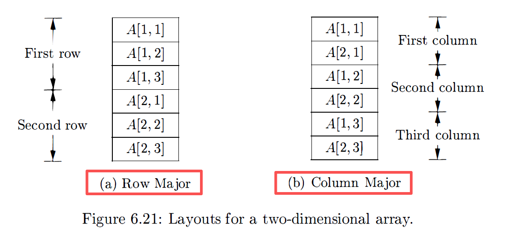

- 按行存放（一行一行存放）
- 按列存放（一列一列存放）

> 多维数组中，扫描存储区域时，按`行方式`的`最右边下标`变化繁琐，而按`列方式`的`最左边下标`变化繁琐。

### 4.4 数组引用的翻译
为数组引用生成代码是要解决的问题：将地址计算公式和数组引用的文法相结合。非终结符L生成一个数组名字加上一个下标表达式的文法为：$L \to L[E] \ | \ id \ [E]$。

翻译方案如下：

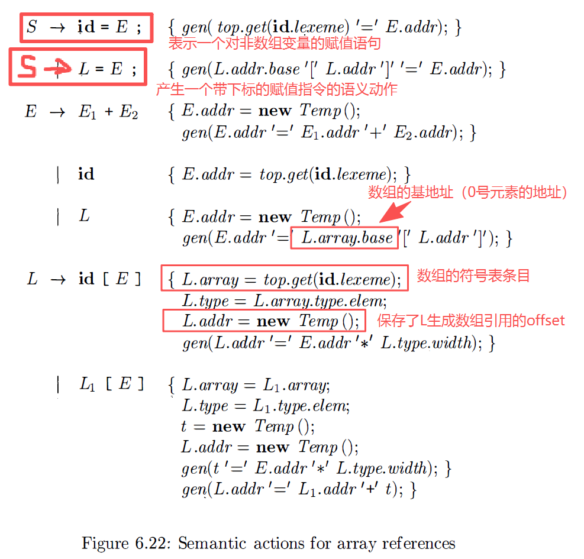

- `L.addr`：表示计算数组引用的偏移量的一个临时变量。
- `L.array`：指向数组名字对应的符号表条目的指针。
- `L.type`：$L$ 生成的子数组的类型。
- 产生式 $S \to id = E$：代表对非数组变量的赋值语句。
- $S \to L = E_1$：一个带下标的复制指令，将表达式的值存到数组引用L所指的内存位置。

翻译流程的总结：

- 计算offset：每增加一个维度，将旧offset 乘以当前维度的宽度，并加上新下标。

- 生成访问指令：

    - 最终通过 $t1 = L.array.base[L.addr]$ 获取值。

    - 或者通过 $L.array.base[L.addr] = t2$ 进行赋值。

## 5. 类型检查
为了类型检查，编译器将源程序的每一个组成部分赋予一个类型表达式，然后确定类型表达式是否满足一组规则，这些规则称为 **源语言的类型系统**。

类型系统通过 **类型表达式** 来描述。可以是：

- 基本类型：如 `boolean`, `char`, `int`, `float`, `void`。

- 类型名字：为类型起的别名。

- 复合类型（构造器）：

    - 数组 (array)
    - 记录 (record)
    - 指针 (pointer)
    - 函数 (function)

为什么需要类型检查？

- 错误检查
    - 静态地确定错误不会在目标程序运行时发生。

- 提高安全性
    - 防止因疏忽造成的错误和恶意攻击。

### 5.1 类型检查规则
- **静态检查 & 动态检查**
    - **静态检查**：编译时完成（龙书讨论重点），效率高，提前发现错误。
    - **动态检查**：运行时完成（如 Python, JavaScript），灵活但有开销。

类型检查的两种形式：

- **类型合成 (Type Synthesis)**：根据子表达式的类型构造出表达式的类型。
    - 要求名字先声明再使用。
    - 自底向上。
    - 推导规则：$$if \quad f的类型为 s \to t 且 x 的类型为 s$$ $$then \ 表达式f(x) 的类型为 t$$

- **类型推导 (Type Inference)**：根据表达式的上下文环境，推断其中缺失的变量类型（如：ML, Haskell, Swift）。

    - 自顶向下或基于约束。
    - 推导规则：$$if \ f(x) 是一个表达式$$ $$then 对某些 \alpha 和 \beta，f的类型为 \alpha \to \beta 且 x 的类型为 \alpha$$

### 5.2 类型转换

编译器的两种类型转换方式：

- **隐式转换（自动类型转换）**
    - `编译器自动`插入指令将一种类型转换为另一种。
    - Java语言中的转换规则：

        - **拓宽转换 (Widening)**：从较窄类型到较宽类型（如 int $\rightarrow$ float），通常是安全的。
        - **窄化转换 (Narrowing)**：可能导致精度丢失，通常需要显式转换。

        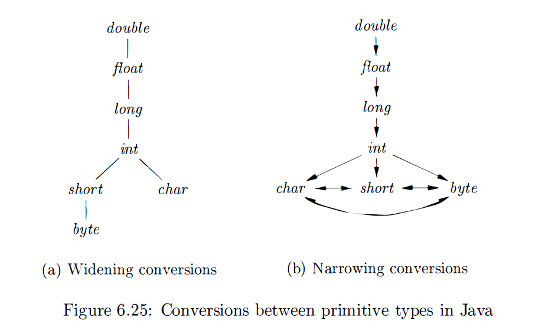


- **显式转换（强制类型转换）**

    - 当程序员必须写出代码来引发类型转换时（如 C 语言中的 (int)x），称为**强制类型转换 (Cast)**。

### 5.3 函数和运算符的重载
在强类型语言中，**重载（Overloaded）** 允许同一个函数名关联多个不同的类型和变量名。而一些运算符的符号会根据所在的上下文不同，被重载的符号则有不同的含义和操作。

对重载函数的类型综合规则：

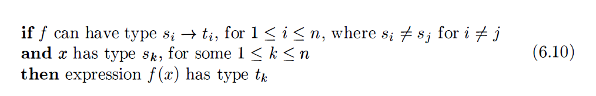

对于同名函数但不同参数的重载问题上的解决方式：

- 编译器通过查看操作数的个数和类型来决定具体调用哪一个函数实现。
- 如果存在多个匹配项或没有匹配项，则编译器直接报错。


### 5.4 类型推导和多态函数
- **类型推导**
    - 不要求名字在使用前声明。
    - 保证名字使用的一致性。

- **多态（Polymorphism）**
    - 任何可以在不同的参数类型上运行的代码片段。

**算法6.16 多态函数的类型推导**

- 输入
    - 由一系列函数定义以及紧跟其后的待求值表达式（表达式：一个函数应用和名字构成）组成的程序。

- 输出
    - 类型推导出程序中名字的类型，或者如果类型不一致则报错。

- 实现方法
    - 通过为程序中的每个子表达式构造 **类型约束（Type Constraints）**，并使用 **合一算法（Unification）** 来解这些约束。

### 5.5 合一算法
给定两个类型表达式 $S$ 和 $T$：

- 如果存在一种对 `类型变量的替换（Substitution）` ，使得替换后的 $S$ 和 $T$ 在`结构上完全一致`，则称 $S$ 和 $T$ 是符合**合一**规则。

- 如果 $s$ 和 $t$ 只有常量没有变量，则 $s$ 和 $t$ 满足合一，当且仅当它们完全相同。


使用 **`图论表示法`** 来实现 **`合一算法`** ，其中

- 基本类型（int, real）是叶子节点。

- 构造类型（$\to$, list, array）是内部节点。

- 类型变量（$\alpha, \beta$）是特殊节点。

结点被分成若干等价类，如果两个结点在同一个等价类中，则代表的类型表达式就必须合一。

> 在同一个等价类中的内部结点必须有同样的类型构造算子，且对应的子结点必须等价。


**算法方法：类型图中的一对结点的合一处理。**

- 输入
    - 一个表示类型的图，以及需要进行合一处理的结点对 $m$ 和 $n$。

- 输出
    - 如果结点 $m$ 和 $n$ 表示的表达式可以`合一`，返回布尔值 `true`，否则返回`false`。

- 方法
    - 查找子结点
        - 找到 $m$ 和 $n$ 所在集合的根结点（使用 find 操作）。令 $`s = find(m), t = find(n)`$。

    - 如果 $s == t$
        - 如果相等，则合一，直接返回成功。

    - 处理基本类型

        - 如果 $s$ 是一个类型变量，将 $s$ 的父节点指向 $t$（`union(s, t)`）。
        - 如果 $t$ 是一个类型变量，将 $t$ 的父节点指向 $s$（`union(t, s)`）。

    - 处理构造类型：如果 $s$ 和 $t$ 都是构造类型（如两者都是 f(s1, s2) 和 f(t1, t2)）：

        - 检查算子：如果算子不同（一个是 list，一个是 array），报错：无法合一。

        - 递归合一子节点：对每一对对应的参数进行合一，即调用 `unify(s1, t1)` 和 `unify(s2, t2)`。

    - 处理冲突：

        - 如果一个是基本类型（int），另一个是构造类型（int $\to$ int），报错：类型冲突。

- 伪代码实现

    ```java
    boolean unify(Node m, Node n) {
        s = find(m); t = find(n);
        if (s = t) return true
        else if (结点s 和 t表示相同的基本类型) return true;
        else if (s 是一个带有子结点s1和s2的op结点 and t 是一个带有子结点t1和t2的op结点) {
            union(s, t);
            return unify(s1, t1) and unify(s2, t2);
        }
        else if (s或者t表示一个变量) {
            union(s, t);
            return true;
        }
        else return false;
    } 
    ```

算法的优点：

- 消除歧义：确定两个看似不同的类型声明是否指向同一事物。
- 多态性支持：算法 6.16
- 错误定位：当 unify 失败时，编译器可以准确指出“第几行预期是 int 结果却是 string”。

## 6. 控制流
将高级语言中的逻辑判断（布尔表达式）和流控制语句（if, while）翻译成底层的三地址码（跳转指令）。

在程序设计语言中，布尔表达式主要有两个用途：

- 改变控制流
    - 用于改变控制流的条件表达式，布尔表达式的值由程序到达的某个位置隐含地指出。
    - 如 `if (a > b) ...`（决定程序跳转到某个位置）。

- 计算逻辑值

    - 一个布尔表达式的值是可以表示 `true` 和 `false`。
    - 如 `x = a > b`;（计算结果是 `true` 或 `false`）。

布尔表达式的使用意图要根据其 **语法上下文** 来确定。

### 6.1 布尔表达式
- **布尔表达式**：由作用于 **布尔变量** 或者 **关系表达式** 的布尔运算符而构成。

- 布尔表达式的文法：

    $$
    B \to B \ || \ B \ \mid \ B \ \&\& \ B \ \mid \ !B \ \mid \ (B) \ \mid \ E \ \text{rel} \ E \ \mid \ \text{true} \ \mid \ \text{false}
    $$


    - 属性 `rel.op`：指明 rel 表示的6种运算符之一：$<、<=、=、!=、> 和 >=$。

### 6.2 短路代码
在 **短路（跳转）** 代码中，布尔运算符 `&&`、`||` 和 `!` 被翻译成跳转指令。

跳转 (Jump)逻辑代码，对于 `B1 || B2`：

- 如果 B1 为真，整个表达式为真，直接跳转到 “true出口”，不需要计算 B2。

- 只有当 B1 为假时，才会去计算 B2。

案例：if (x < 100 || x > 200 && x != y) x = 0; 翻译成的三地址码逻辑：

```c
      if x < 100 goto L2  // 短路：直接进 if 体
      if False x > 200 goto L1
      if False x != y goto L1
L2:   x = 0               // if 体 (True 出口)
L1:   ...
```

### 6.3 控制流语句
把布尔表达式翻译成三地址代码的常见文法结构的产生式：

$$S \to if \ (B) \ S_1$$

$$S \to if \ (B) \ S_1 \ else \ S_2$$

$$S \to while \  (B) \ S_1$$

- 非终结符 $B$ 表示一个`布尔表达式`，非终结符 $S$ 表示一个`语句`。

$B.code$ 和 $S.code$ 的跳转符号使用继承属性来处，为了可以正确的跳转，将布尔表达式 $B$ 和两个标号：$B.true$ 和 B.false 相关联：

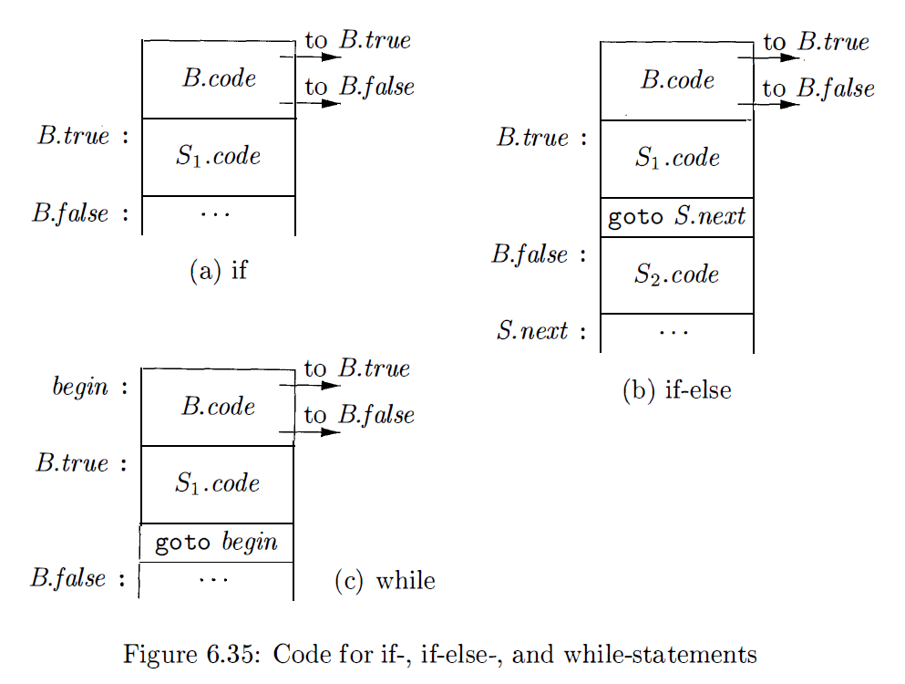

- 当 $B$ 为 `true` 时，控制流跳转到 $B.true$。
- 当 $B$ 为 `false` 时，控制流跳转到 $B.false$。
- $S.next$：新的标号，语句 $S$ 执行完后，应该跳转到的位置（通常是下一条指令）。

控制流语句的语法制导定义如下：

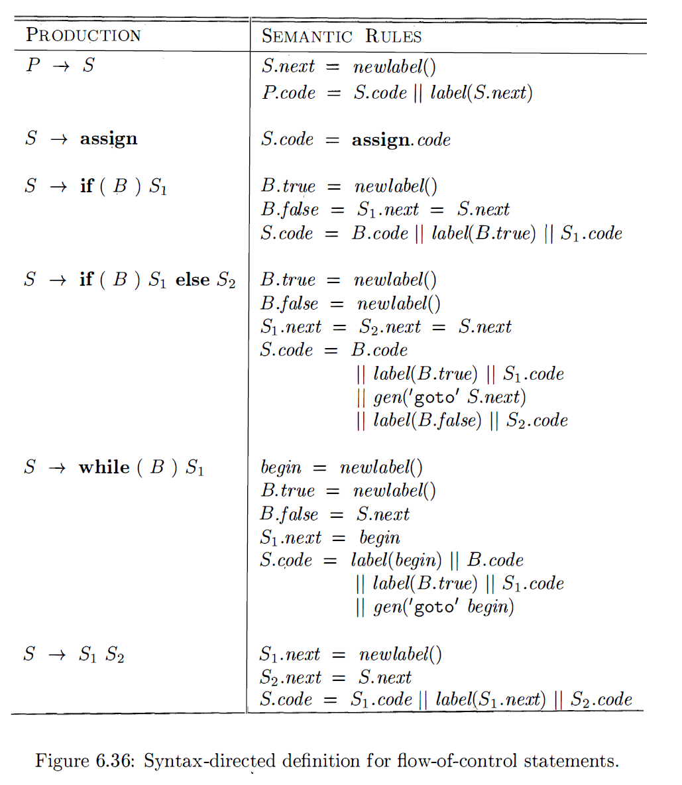

- 每次调用 newlabel() 都会产生一个新的标号，并假设 label(L) 将标号 $L$ 附加到即将要生成的下一条三地址指令上。


### 6.4 布尔表达式的控制流翻译
将布尔表达式转换成三地址表达式的翻译代码如下：

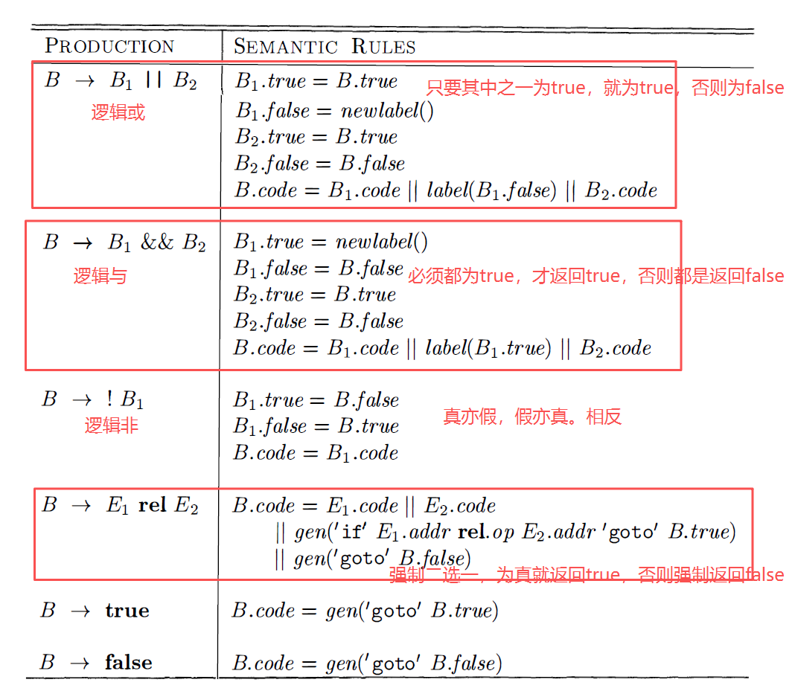


### 6.5 避免生成冗余的`goto`指令

对于表达式 x > 200 这个语句的代码片段：

```c
if x < 100 goto L4
goto L1
L4: ...
```

替换为新的指令：

```c
ifFalse x > 200 goto L1
L4: ...
```

优化策略：Fall-Through (穿透)

- 如果控制流的“下一条指令”恰好就是“跳转目标”，则不生成跳转指令。
- 特殊标签 fall（不生成任何跳转指令）：不跳转，直接向下执行。

修改布尔表达式的语义规则，要尽可能地允许控制流Fall-Through。 

```c
B1.true = if B.true != fall then B.true else newLabel()
B1.false = fall
B2.true = B.true
B2.false = B.false
  B.code = if B.true != fall then B1.code || B2.code else B1.code || B2.code || label(B1.true)
```

## 7. 回填

在单次扫描 (One-Pass) 中生成布尔表达式和控制流语句的目标代码。需要解决“先生成跳转指令，后确定跳转目标”的问题。

**回填技术的基本思想**：生成一个跳转指令时，暂时不指定该跳转指令的目标标号。这样的指令都被放入由跳转指令组成的列表中，等到能够确定正确的目标标号时，才去填充这些指令的目标标号；

### 7.1 使用回填技术的一趟式目标代码生成
- **回填技术**
    - 将由跳转指令组成列表，通过综合属性的形式进行传递。
        - 生成一个跳转指令时暂时不指定该跳转指令的模板。
    - 可以用来解决一遍扫描中完成对布尔表达式或者控制流语句的目标代码生成。

- 给非终结符号 $B$ 设置的两个综合属性用来管理布尔表达式的跳转代码中的标号：

    - $`B.truelist`$：指向一个包含 `跳转` 或者 `条件跳转指令` 的列表。
        - 这些指令最终获得的目标标号就是当$B$为 `真` 时控制流应该转向的指令的标号。
    - $`B.falselist`$：指向一个包含 `跳转指令` 的列表。
        - 这些指令最终获得的目标标号就是当$B$为 `假` 时控制流应该转向的指令的标号。

- 为了处理跳转指令的列表，会使用的三个关键函数：

    - `makelist(i)`：创建一个只包含指令地址 i 的列表。
        - 函数返回一个指向新创建的列表的指针。

    - `merge(p1, p2)`：将列表 p1 和 p2 合并，返回的指针指向合并后的新列表。

    - `backpatch(p, i)`：将列表 p 中的所有指令的跳转目标都设置为 i。


### 7.2 布尔表达式的回填

**标记非终结符 $M$ (Marker)**：它对应的语义动作是为了在适当的时刻获取将要生成的下一条指令的下标，我们引入一个产生空串的非终结符 $M$：

- 产生式：$M \to \epsilon$
- 语义动作：$\{ M.instr = nextinstr; \} $// 记录当前指令计数器

产生式：$B \to B1 \ ||\  M \ B2$ 的翻译规则说明：

```c
backpatch(B1.falselist, M.instr); 
   // 解析：如果 B1 为假，不要立即跳出，而是跳到 B2 的开始处（M.instr）继续判断。

B.truelist = merge(B1.truelist, B2.truelist);
   // 解析：无论 B1 真还是 B2 真，整个表达式都为真，合并真出口。

B.falselist = B2.falselist;
   // 解析：只有 B2 也为假，整个表达式才为假。
```

### 7.3 控制转移语句
使用回填技术来处理在一遍扫描中完成控制语句的翻译。非终结符 $S$ 和 $L$ 生成的语句中也需要一个待回填的跳转指令列表，由属性 `nextlist` 表示。

> $S.nextlist$：包含了所有跳转到按照运行顺序紧跟在S代码后的指令的条件或者无条件转移指令。$L.nextlist$：和 $S.nextlist$ 的定义也类似。

**条件语句（`if`、`if ... else` 语句）**

- 语法产生式：$S \to \text{if } (B) \ M \ S_1$
    - 翻译逻辑：
        - 回填 B.true：`backpatch(B.truelist, M.instr)`。如果 $B$ 为真，跳到 $S_1$ 的开始（$M$ 的位置）。

        - 合并出口：`S.nextlist = merge(B.falselist, S1.nextlist)`。

            - 如果 $B$ 为假，跳过 $S_1$（$S$ 的一个出口）。

            - 如果 $S_1$ 执行完，也是 $S$ 的出口。


**循环语句（`while` 和 `for`）**

- 语法产生式：($S \to \text{while } M_1 (B) \ M_2 \ S_1$)
    - 翻译逻辑：
        - 回填S1.nextlist：执行 backpatch(S1.nextlist, M1.instr)。将循环体 $S_1$ 结束后的跳转目标，或者内部的 continue 目标，回填为条件判断的起点 $M$。
            - $S_1.\text{nextlist}$：必须跳回 $M$ 以实现循环。
        - 执行backpatch(B.truelist, M2.instr)：当条件 $B$ 为真时，直接进入紧跟在 $B$ 之后的循环体 $S_1$。
            - $B.\text{truelist}$：回填至 $S_1$ 的起始处。

        - 确定假出口：S.nextlist = B.falselist：整个 while 语句的出口即为条件 $B$ 失败时的跳转目标。
            - $B.\text{falselist}$：成为 $S$ 的 nextlist，等待循环外的下一条语句回填。
    
        - 生成无条件跳转：gen('goto', M.instr)。在循环体 $S_1$ 的最后生成一条强制跳转指令，跳回 $M.instr$ 重新进行条件判断。

### 7.4 `break`语句、`continue`语句和`goto`语句

- `break / continue`：需要维护上下文堆栈。

    - 每当进入一个循环（while, for），不仅生成代码，还要将当前的循环结构信息入栈。

    - 遇到 break：生成一个未完成的跳转指令：`gen('goto _')`，将其加入当前栈顶循环的 breaklist。

    - 退出循环时：用循环结束后的地址回填 breaklist。

    - 遇到 continue：类似，加入 continuelist，最后回填到条件判断处。


- `continue`语句
    - 作用：触发外围循环的下一轮迭代。
    - 它的 nextlist 不会指向循环外的出口，而是指向循环的更新部分或条件判断部分（$M1$）。

- `goto`语句

    - 在实现goto语句时，可以为每个标号维护一个未完成跳转指令的列表，然后在知道指令的目标后进行回填。
    - 如果是`向后跳转（跳到已定义的 Label）`：直接生成。
    - 如果是`向前跳转（跳到未知 Label）`：创建一个列表，挂在符号表的该 Label 条目下，等 Label 定义时一次性回填。

## 8. switch语句
语句中包含一个待求值的选择表达式 $E$，后面是该表达式可能取的 $n$ 个常量值 $V_1, V_2, \dots, V_n $，另外可能包含一个默认 “值”。

> 默认值是与表达式无法匹配时，才使用这个默认值。

`switch` 语句的语法格式：

```c
switch (E) {
    case V1: S1;
    case V2: S2;
    ...
    case Vn-1: Sn-1;
    default: Sn;
}
```

### 8.1 switch语句的翻译
switch 语句的翻译进行的代码工作：

- 计算表达式 $E$ 的值。
- 在 `case` 列表中寻找匹配的值 $V_i$。
    - 如果找到，跳转到对应的语句 $S_i$；
    - 如果没找到，跳转到 `default` 分支。

对于case列表可能有n路分支，编译器会根据 $V_i$ 的数量，从而采取不同的方法策略来实现跳转：

- 如果 case 的数目`较少（不多于10个）`时，可以使用一个条件跳转指令序列来实现。
    - 给每个条件跳转指令都测试一个常量值，并跳转到这个值对应的语句的代码。

- 如果 case 的个数`超过10个或更多`时，为这些case值构造一个散列表。
    - 散列表中的条目是各个分支语句的标号。
    - 如果没找到表达式对应的的值的条目，就有一条跳转指令跳转到默认语句。

- 特殊且高效的情况：二分查找

    - 执行switch语句时，先计算表达式并获得值 $j$，检查它是否在 min 和 max 的范围内
        - 如果是，则间接跳转到偏移量为 $j - min$ 的条目的标号。

### 8.2 switch语句的语法制导翻译

一个switch语句的翻译结果:

```c
      code to evaluate E into t    // 1. 计算条件
      goto test                    // 2. 跳过所有语句，直接去测试

L1:   code for S1                  // 3. case V1 的语句体
      goto next                    //    (如果没有 break,会直接进行S2)
L2:   code for S2                  // 4. case V2 的语句体
      goto next
      ...
Ln:   code for Sn                  // 5. default 的语句体
      goto next

test:                              // 6. test 段
      if t = V1 goto L1
      if t = V2 goto L2
      ...
      goto Ln                      // 7. 都不匹配，跳转到 default

next:                              // 8. switch 结束出口
```

- 在进行语法制导翻译时，需要两个核心辅助结构：
    - 辅助标号：
        - `S.test (测试入口)`：记录 test 标号的位置。
        - `S.next (出口)`：记录 switch 结束后的地址（用于 break 跳出）。
        - 辅助变量 $t$

    - case 列表：

        - 在处理 `case Vi`: Si 时，编译器并不会立即生成 `if t == Vi`。

        - 它会将`二元组 (Vi, Label_Si)` 存入一个列表中。

        - 只有当解析完整个 `switch` 块，到达 test 标号时，编译器才遍历列表，生成上述的比较指令序列。

- 处理步骤

    - 进入 `switch`：生成计算 $E$ 的代码，生成 `goto test`。

    - 处理 `case`：

        - 为当前 `case` 生成标号 $L_i$。

        - 记录 (Vi, Li) 到列表。

        - 生成 $S_i$ 的代码。

    - 处理 `default`：记录 `default` 对应的标号 $L_{def}$。

    - test 段：

        - 生成 test: 标号。

        - 读取 `case` 列表，根据策略（`跳转表或二分方法`）生成跳转指令。

        - 生成 `goto L_i`。


## 9. 过程的中间代码
产生式可以生成函数定义和函数调用：

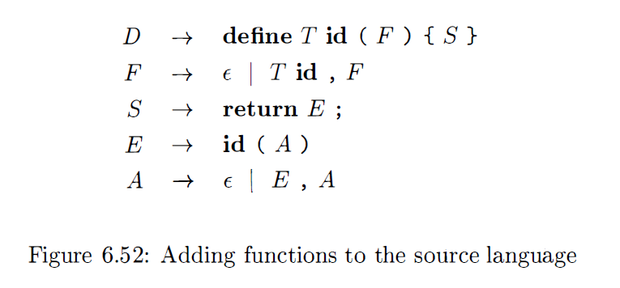

- $D$ 生成的函数定义包含了`关键字 define`、`返回类型`、`函数名`、括号中的`形式参数`以及由花括号中的语句组成的`函数体`。

- 非终结符 $F$ 生成`0个`或者`多个形式参数`，每个形式参数包含一个`类型`和`标识符`。
- 非终结符 $S$ 生成`语句（包含返回表达式值的语句）`。
- 非终结符 $E$ 生成`表达式（函数调用也是表达式）`。
- A 会生成调用中的实际参数。一个实际参数就是一个表达式。

编译器必须为过程调用和返回生成良好的代码，用于处理过程的参数传递、调用和返回的运行时例程是运行时支持系统的一部分。